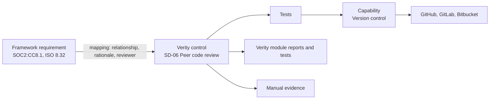

# Control framework requirements

A working addendum to the signed specification. The signed documents stay untouched; this file
records how Verity's control library, automation, module evidence and future frameworks are read
and built, so every phase starts from an agreed reading. Items beyond the signed scope say so and are
agreed before work starts (delivery plan: "anything not listed in a phase is scoped separately").

Build reference: `openspec/changes/common-control-framework/`. Decision: ADR-0014.

Sources: signed specification (1.1 control library, 2.1 connectors, 2.2 monitoring, 3.1 frameworks,
section 8 catalogue); NIST IR 8477 (mapping relationships) and IR 8278A (strength of relationship);
OSCAL 1.2 control mapping model; Secure Controls Framework STRM; CISO Assistant mapping libraries;
Drata DCF and test documentation; Vanta and Secureframe control and test documentation.

## How it fits together

A company works one set of Verity controls. Frameworks are views over those controls: each
requirement points at the controls that meet it. A second framework reuses every control it shares
with the first and adds controls only for what is new. Evidence is collected once per control and
counts for every framework the control maps to.

## 1. The Verity control framework (CF)

| ID | Requirement | Acceptance |
|---|---|---|
| CF-1 | One framework neutral library of Verity controls. Each control has a stable public code (`IAM-03`) and canonical key; codes are never reused. A workspace holds one control per canonical key however many frameworks point at it. | Activating a framework that maps to IAM-03 adds no second MFA control; the existing control lists both frameworks' requirements. |
| CF-2 | Each control carries objective, statement, implementation guidance, test procedure (how an auditor tests it), evidence guidance, frequency, applicability conditions, type and sub type. | Content CI fails a published control missing objective, test procedure or evidence guidance. |
| CF-3 | Every mapping records relationship (equal, subset of, superset of, intersects with), rationale type (syntactic, semantic, functional), strength 0 to 10, coverage (full or partial), a written rationale, source, author and reviewer. | The loader rejects a published mapping without rationale or reviewer. |
| CF-4 | A requirement is met only when every published control mapped to it is in scope, implemented and passing. Partial coverage never shows as met. | A requirement with one full and one partial control shows partly met until both pass. |
| CF-5 | No cross framework inference. An ISO requirement's status never derives from a SOC 2 criterion; it comes from the shared controls and their evidence. Anything the platform suggests from a crosswalk is a draft a person confirms (rule 11). | Unmapping IAM-08 from ISO 5.15 changes ISO 5.15 only; no SOC 2 state changes. |
| CF-6 | A workspace can add or remove mappings on its own controls, with a reason. Library updates never overwrite tenant edits; changed library wording is offered, not applied. | Adopted controls show "Library wording changed"; accepting it writes an audit row. |
| CF-7 | Controls are deprecated, never deleted. A superseded control names its successor and the workspace is guided across. | A deprecated template still renders on historic engagements. |
| CF-8 | Requirement text follows the publisher's licence (design section 6). The SOC 2 pack moves to identifiers and Verity summaries unless AICPA permission is recorded. | The loader refuses a pack whose text breaks its declared text policy. |
| CF-9 | The published crosswalk exports with relationship, rationale and reviewer, so an auditor can inspect it outside Verity. CSV first; OSCAL 1.2 mapping collection is an extension. | Export row count equals published mappings for the framework. |
| CF-10 | Content provenance: each loaded pack records version, hash, source and licence note. The control library credits Probo (MIT). | `framework_packs` has a row per load; the notice is in the repository. |

## 2. Automation on the control page (AU)

| ID | Requirement | Acceptance |
|---|---|---|
| AU-1 | Every automated or hybrid control shows an Automation panel: each test, what it checks, how often, the capability it needs, the providers that supply that capability, and which of them the workspace has connected. | SD-06 lists its tests under Version control with GitHub, GitLab and Bitbucket, the connected one marked. |
| AU-2 | One connected provider per required capability is enough ("connect one of"). A test needing two capabilities says so (HR system and identity provider). With several providers connected, the test runs on each and all must pass. | Connecting GitLab alone moves SD-06 tests from not configured to running. |
| AU-3 | A system Verity does not support: "Request an integration" captures provider, capability and use. The request is visible to the provider team; the control keeps its manual evidence path meanwhile. | The request is stored, audited, listed in the provider plane, and shows as Requested on the control. |
| AU-4 | Provider status is honest: available, beta, or planned with its phase. Nothing shows connected or passing until a real connection has run. | A planned provider cannot be connected and shows its phase. |
| AU-5 | Test states are pass, fail, error, not applicable and stale. Not configured is derived when no provider is connected and counts neither as pass nor fail. Error is never fail. | A revoked token turns results to error, not fail, and alerts the connection owner. |
| AU-6 | A control's automated status is failing if any enabled test fails on any in scope resource without a live waiver; else error; else passing; else not configured. A control with some tests not running says how many run. | The control reads "Passing, 2 of 3 tests running". |
| AU-7 | Monitoring over time: every run is kept append only. Each control shows its history and, for a Type II window, the share of days on which all its tests passed. | A control failing on 3 days of a 90 day window shows 96.7 percent and lists the three days. |
| AU-8 | One finding per failing test, connection and resource; it resolves itself on the next pass; state changes alert (spec 2.2). | A test failing on three repositories opens three findings. |
| AU-9 | Tests can be scoped (repositories, accounts, tags). Excluding a resource needs a reason, is audited and is printed on the evidence. | An excluded sandbox repository appears in the evidence exclusions list. |
| AU-10 | Waivers are time boxed, justified and approved by someone other than the requester; expiry reopens the finding. | The requester cannot approve their own waiver. |
| AU-11 | Every run produces an evidence item with the raw snapshot, its hash and the resources read, attached to every control the test maps to. | One run of a shared test attaches to both controls that use it. |
| AU-12 | Tests run only for controls in scope of an active framework. | Disabling a control stops its tests and alerts. |

## 3. Verity modules as evidence (ME) (extension, proposed for Phase 2)

| ID | Requirement | Acceptance |
|---|---|---|
| ME-1 | Verity is a built in, always connected provider. Modules publish capabilities: asset inventory, vulnerability management, risk management, vendor management, policy management, task management; later access reviews, incident management, training records. | The Automation panel shows "Verity (built in)" as the connected provider for LM-01. |
| ME-2 | Platform tests run on module data with the same states, findings and history as connector tests (appendix C). | An asset without an owner fails `verity.assets.owner_assigned` and opens a finding. |
| ME-3 | Evidence reports are an XLSX with fixed columns plus a PDF cover: source module, filters, generated at and by, row count, completeness statement and the SHA256 of the XLSX. Screenshots are not used as platform evidence. | The hash on the cover matches the file; unchanged data and filters give the same rows. |
| ME-4 | Reports generate on the control's frequency and on demand, are stored as evidence, attach to every mapped control and renew through the evidence renewal queue. | A quarterly report appears as new evidence each quarter without anyone uploading it. |
| ME-5 | A report is information produced by the entity. The cover states the filters and that every record matching them at that moment is included, so an auditor can reperform it. | Rerunning with the cover's parameters reproduces the population. |
| ME-6 | Reports and platform tests read module data through module services only (rule 4), inside RLS, and never include secrets. | import-linter keeps the automation module off other modules' models. |
| ME-7 | The control page lists evidence sources in one panel: manual evidence types, platform reports and connector tests. | LM-01 shows the asset inventory report, cloud inventory tests and manual upload. |
| ME-8 | A module that is not built shows its capability as Soon; its controls stay on manual evidence. | IAM-02 shows Access reviews as Soon until Phase 3.2. |

## 4. Adding frameworks (FW)

| ID | Requirement | Acceptance |
|---|---|---|
| FW-1 | A framework ships as a content pack: manifest (publisher, version, licence, text policy, maturity), requirements, mappings, new controls and tests. Loading never changes a workspace's controls. | Loading ISO 27001 leaves every existing workspace unchanged until it activates ISO. |
| FW-2 | Maturity is requirements only, mapped, or automated. A framework can ship at requirements only and deepen without a migration. | A requirements only framework can be activated and mapped by the workspace itself. |
| FW-3 | Every requirement is mapped to Verity controls, marked organisational, or marked not applicable to a SaaS provider with a reason. | Content CI fails a pack with an unhandled requirement. |
| FW-4 | Requirements no existing control meets get new controls in the same library with their own codes. A control is never forked per framework. | ISO clause 4.3 (ISMS scope) arrives as one new control, adoptable by any workspace. |
| FW-5 | Reference crosswalks (the publisher's own, NIST authored OLIR) are inputs. The shipped crosswalk is Verity's, signed by author and a qualified second reviewer (ISO lead auditor or implementer; CISA or CPA for SOC 2; privacy counsel for GDPR; HIPAA specialist for HIPAA). | A pack without two signatures does not load in production. |
| FW-6 | Before activation a workspace sees an overlap preview: requirements already covered by controls it runs, partly covered, and the new controls it will adopt. Adoption is one transaction and audited. | The preview counts match what activation adopts. |
| FW-7 | ISO Statement of Applicability: per Annex A control, applicable or not, justification, implementation status and owner, exportable as XLSX. Clauses 4 to 10 are always applicable and cannot be excluded. | Excluding an Annex A control without justification is refused; clause rows have no exclude action. |
| FW-8 | HIPAA specifications carry required or addressable. An addressable specification is implemented, or has a documented reason and an equivalent alternative; it is never simply skipped. | Marking an addressable specification not implemented requires both fields. |
| FW-9 | Engagements pin a framework version. A new publisher version ships with transitions, and a workspace upgrades through a guided diff with its work carried across. | An open engagement keeps its version after the upgrade ships. |
| FW-10 | One audit engagement per framework version, so SOC 2 and ISO audits run side by side on the same controls and evidence. | Two engagements share one evidence item. |
| FW-11 | Extension: a workspace imports its own framework (customer contract, internal standard) from a CSV template and maps it to its controls. | The imported framework reports readiness like a shipped one. |

## 5. Framework order

| Order | Framework | Why | Text in the product | Scope |
|---|---|---|---|---|
| 1 | ISO/IEC 27001:2022 | Largest overlap with SOC 2; the next ask from buyers outside the US. Needs management system controls (clauses 4 to 10) and the Statement of Applicability. | Identifiers and Verity summaries | Signed, Phase 3 |
| 2 | HIPAA Security Rule | US healthcare customers. Required and addressable specifications. The December 2024 proposed rule is not final; ship the current rule and track it. | Full text | Signed, Phase 3 |
| 3 | GDPR | EU customers. The privacy controls (DM series, SOC 2 P criteria) already cover part. | Full text with attribution | Signed, Phase 3 |
| 4 | NIST CSF 2.0 | Public domain, 106 subcategories, NIST publishes informative references. | Full text | Extension |
| 5 | NIS2, DORA | EU essential entities and financial entities. | Full text with attribution | Extension |
| 6 | PCI DSS 4.0.1 | Only after a PCI SSC licence is in place. | Numbers and Verity summaries | Extension |
| 7 | ISO/IEC 42001 | AI management; reuses the ISO management system controls from step 1. | Identifiers and Verity summaries | Extension |

## 6. Open questions (answer before the dependent work starts)

1. **HR and device connectors.** The signed catalogue (section 8) has no HR system and no device
   management or endpoint protection connector, and the delivery plan excludes an endpoint agent.
   HR-01, HR-05, HR-06, HR-08 and EP-01 to EP-06 need those capabilities to automate. Proposed
   reading: those capabilities list their providers as "Not in plan, request it", the controls stay
   on manual evidence, and a people roster import (CSV) is offered as the source of joiners and
   leavers until an HR connector is agreed.
2. **Connections page catalogue.** The in-product list (40 providers) differs from section 8: it
   shows Workday, Jamf, CrowdStrike and others the spec does not list, and omits 1Password, Tailscale,
   Render, Vercel, Tenable and others it does. Proposed reading: the content pack follows section 8
   and anything else is marked as an extension (task B4).
3. **SOC 2 text.** Obtain AICPA permission, or move to identifiers and Verity summaries before
   commercial sale (task A4).
4. **Second reviewer.** Who signs mappings (task A5 and every new pack)? The client's audit partner
   is the natural choice.
5. **Module evidence scope.** Platform reports and tests are not in the signed specification.
   Proposed: agree them as a Phase 2 extension alongside 2.2 monitoring.
6. **Observation coverage.** "Share of days all tests passed" is a Verity measure to help a team
   prepare. It does not replace the auditor's sampling and is labelled that way.

## Appendix A. Capabilities and providers (signed catalogue)

| Capability | Providers and delivery | Controls it automates |
|---|---|---|
| Cloud infrastructure | AWS (Phase 2); Azure, Google Cloud, DigitalOcean, Heroku, Render, Vercel, Netlify, Supabase, Neon, Qovery (Phase 3) | NS-01 to NS-09, BC-01, BC-04, LM-01, LM-02, LM-03, LM-09, DM-13, SD-12 |
| Version control | GitHub, GitLab, Bitbucket (Phase 2) | SD-01, SD-06, SD-11 |
| CI and CD | GitHub, GitLab, Bitbucket pipelines (Phase 2) | SD-02, SD-03 |
| Identity provider | Okta, Google Workspace, Microsoft 365 and Entra ID (Phase 2) | IAM-03, IAM-04, IAM-06, IAM-11, IAM-12, HR-05 (with an HR source) |
| Password manager | 1Password (Phase 2) | IAM-05 |
| Ticketing | Jira (Phase 2); Linear, Asana, ClickUp, Monday, Notion (Phase 3) | SD-01, IAM-01, GOV-08 |
| On call and alerting | PagerDuty, Slack (Phase 2) | LM-08, LM-09, CS-03 |
| Network and edge | Cloudflare, Tailscale (Phase 2) | NS-02, NS-10, NS-11 |
| Observability | Datadog, Sentry (Phase 2); Grafana, SigNoz, Better Stack (Phase 3) | LM-02, LM-09, BC-04 |
| Vulnerability scanner | Tenable Nessus, Rapid7 Nexpose, Qualys (Phase 3) | LM-11, EP-04 |
| Asset discovery | BMC (Phase 3) | LM-01 |
| Business applications | HubSpot, Intercom, Zendesk, PostHog, SendGrid, Resend, OpenAI, Anthropic (Phase 3) | BC-05, BC-07, DM-06 |
| HR system | Not in the signed catalogue (question 1) | HR-01, HR-05, HR-06, HR-08 |
| Device management, endpoint protection | Not in the signed catalogue (question 1) | EP-01 to EP-06 |
| Verity (built in) | Always connected | Appendix B |

## Appendix B. Module, control and criteria matrix

SOC 2 is the published library mapping. The ISO 27001:2022 column is a draft for the task E3 review
(identifiers only, clauses marked "Cl."). It is not content until reviewed under FW-5.

| Module | Verity control | SOC 2 | ISO 27001:2022 (draft) |
|---|---|---|---|
| Assets | LM-01 Asset and system inventory | CC2.1 (review: the CC6.1 points of focus name the asset inventory) | 5.9 |
| Assets | DM-04 Data classification policy | C1.1 | 5.12, 5.13 |
| Assets | DM-06 Data inventory and data map | C1.1 | 5.9, 5.34 |
| Assets | DM-16 Secure data disposal | C1.2, CC6.5, P4.3 | 7.14, 8.10 |
| Vulnerabilities | LM-11 Vulnerability management program | CC7.1 | 8.8 |
| Vulnerabilities | EP-04 Patch management | CC6.8, CC7.1 | 8.8 |
| Vulnerabilities | SD-03 Dependency and image scanning | CC6.8, CC7.1 | 8.8, 8.28 |
| Vulnerabilities | GOV-16 Annual penetration test | CC4.1, CC7.1 | 8.8 |
| Risk register | GOV-18 Annual risk assessment | CC3.1, CC3.2 | Cl. 6.1.2, 8.2 |
| Risk register | GOV-19 Risk register with treatment decisions | CC3.2, CC5.1 | Cl. 6.1.3, 8.3 |
| Risk register | GOV-20 Risk treatment plan | CC3.2, CC9.1 | Cl. 6.1.3, 8.3 |
| Risk register | GOV-07 Risk to control mapping | CC5.1 | Cl. 6.1.3 |
| Risk register | GOV-03 Change triggered risk review | CC3.4 | Cl. 8.2 |
| Risk register | GOV-12 Fraud and insider threat consideration | CC3.3 | None (SOC 2 only) |
| Vendors | BC-07 Vendor inventory | CC9.2 | 5.19 |
| Vendors | BC-08 Vendor security due diligence | CC9.2 | 5.19, 5.22 |
| Vendors | BC-06 Subprocessor management | CC9.2, P6.1 | 5.21 |
| Vendors | DM-10 Data processing agreements | P6.4, CC9.2 | 5.20, 5.34 |
| Vendors | DM-17 Vendor breach notification terms | P6.5 | 5.20 |
| Vendors | PE-01 Cloud physical security (subservice review) | CC6.4 | 5.23 |
| Documents | GOV-17 Security policy suite | CC5.3 | 5.1 |
| Documents | GOV-01 Annual policy review | CC5.3 | 5.1 |
| Documents | CS-04 Internal policy portal | CC2.2 | 5.1 |
| Documents | GOV-04 Code of conduct and ethics policy | CC1.1 | 5.10, 6.2 |
| Tasks | GOV-08 Deficiency remediation tracking | CC4.2 | Cl. 10.2 |
| Controls and evidence | GOV-06 Continuous control monitoring | CC4.1 | Cl. 9.1 |
| Controls and evidence | GOV-09 Assigned control ownership | CC1.3, CC1.5 | 5.2 |
| Controls and evidence | GOV-13 Internal audit or readiness assessment | CC4.1 | Cl. 9.2 |
| Controls and evidence | GOV-15 Periodic management review | CC1.2, CC4.2 | Cl. 9.3 |
| Access reviews (Phase 3.2) | IAM-02 Periodic user access reviews | CC6.3 | 5.18 |
| Access reviews (Phase 3.2) | IAM-07 Privileged access management | CC6.3 | 8.2 |
| Access reviews (Phase 3.2) | IAM-09 Segregation of duties | CC6.3 | 5.3 |
| Access reviews (Phase 3.2) | IAM-12 Timely access removal | CC6.2 | 5.18 |
| Incidents (Phase 3.1) | LM-07 Incident response plan | CC7.4 | 5.24 |
| Incidents (Phase 3.1) | LM-04 Security event evaluation | CC7.3 | 5.25 |
| Incidents (Phase 3.1) | LM-06 Incident recovery procedures | CC7.5 | 5.26 |
| Incidents (Phase 3.1) | LM-05 Incident postmortems with actions | CC7.4, CC7.5 | 5.27 |
| Incidents (Phase 3.1) | LM-10 Incident tabletop exercise | CC7.4 | 5.24 |
| Incidents (Phase 3.1) | CS-03 Security incident reporting channel | CC2.2 | 6.8 |
| People (question 1) | HR-08 Security awareness training | CC1.4, CC2.2 | 6.3 |
| People (question 1) | HR-05 Offboarding and deprovisioning | CC6.2 | 5.11, 5.18 |
| People (question 1) | HR-01 Pre-hire background checks | CC1.1 | 6.1 |
| People (question 1) | HR-02 Confidentiality and IP agreements | CC1.1, C1.1 | 6.6 |

Expected new controls for ISO (confirmed in the E3 gap analysis): ISMS scope (Cl. 4.3), interested
parties and their requirements (Cl. 4.2), information security objectives (Cl. 6.2), Statement of
Applicability (Cl. 6.1.3 d), competence records (Cl. 7.2), control of documented information
(Cl. 7.5), and Annex A controls with no SOC 2 counterpart such as threat intelligence (5.7), contact
with authorities and special interest groups (5.5, 5.6), data masking (8.11), data leakage
prevention (8.12) and web filtering (8.23).

## Appendix C. Platform tests and evidence reports

| Test | Passes when | Controls |
|---|---|---|
| `verity.assets.owner_assigned` | Every active asset has a primary owner. | LM-01 |
| `verity.assets.classified` | Every active asset that stores or processes data has a classification. | LM-01, DM-04 |
| `verity.assets.reviewed` | Every active asset was reviewed in the last 12 months. | LM-01 |
| `verity.assets.disposal_recorded` | Every retired asset has a decommission record with method and sanitisation. | DM-16 |
| `verity.vulns.within_sla` | No open critical or high finding is past SLA without an unexpired acceptance. | LM-11, EP-04 |
| `verity.vulns.kev_owned` | Every open finding on a KEV listed vulnerability has an owner. | LM-11 |
| `verity.risks.reviewed` | Every open risk was reviewed within its register's cadence. | GOV-18 |
| `verity.risks.treated` | Every risk above the register's acceptance band has an owner and a treatment decision. | GOV-19, GOV-20 |
| `verity.risks.controls_linked` | Every risk treated by mitigation has at least one linked control. | GOV-07 |
| `verity.risks.acceptance_current` | No accepted risk has an expired acceptance. | GOV-19 |
| `verity.vendors.owner_and_tier` | Every active vendor has a business owner and a tier. | BC-07 |
| `verity.vendors.assessed_in_cadence` | Every active critical or high vendor was assessed within its tier cadence. | BC-08 |
| `verity.vendors.dpa_on_file` | Every active vendor that stores personal data has a linked data processing agreement. | DM-10 |
| `verity.policies.reviewed` | Every required policy is published and was approved in the last 12 months. | GOV-01, GOV-17 |
| `verity.policies.acknowledged` | The target share of members (default 95 percent) acknowledged each required policy's current version. | CS-04, GOV-04 |
| `verity.tasks.remediation_in_sla` | No remediation task linked to a control, finding or risk is past SLA. | GOV-08 |
| `verity.controls.owned` | Every in scope control has an owner. | GOV-09 |
| `verity.evidence.current` | No in scope control relies only on expired evidence. | GOV-06 |

| Report | Columns |
|---|---|
| Asset inventory | Asset ID, name, type, environment, status, tier, criticality, data classification, regulated data, compliance scope, internet facing, primary owner, business owner, custodian, location, cloud resource ID, last seen, last reviewed, open critical and high findings, linked risks |
| Decommissioned assets | Asset ID, name, decommissioned at, by, disposal method, media sanitised, evidence reference, replacement asset, reason |
| Vulnerability SLA | Finding ID, CVE, title, severity, CVSS, EPSS, KEV, asset, asset tier, state, owner, first detected, SLA due, days past SLA, acceptance reason, acceptance expiry, fixed at, fix verified |
| Risk register | Risk ID, title, register, category, owner, status, inherent score and band, treatment, residual score and band, treatment due, linked controls, acceptance approver, acceptance expiry, last reviewed, next review |
| Vendor register | Vendor, type, services, lifecycle status, tier, residual score, stores personal data, data location, systems in scope, business owner, security owner, last assessment, next reassessment, agreements on file |
| Policy register | Document ID, title, type, classification, lifecycle, current version, owner, approved at, published at, renewal date, linked controls |
| Policy acknowledgements | Campaign, document, version, member, assigned at, acknowledged at, status |
| Remediation tasks | Task ID, title, kind, priority, severity, owner, status, raised from, created, SLA due, resolved, within SLA |

Every report carries the PDF cover of ME-3: report name, workspace, source module, filters,
generated at (UTC), generated by (person or schedule), row count, completeness statement, SHA256 of
the XLSX, Verity version and the controls it is attached to.

## Appendix D. Worked examples

**SD-06 Peer code review.** Capability: version control, one of GitHub, GitLab or Bitbucket.
Tests: every in scope repository protects its default branch; merges to it need at least one
approval from someone other than the author; administrators cannot bypass. Daily. Evidence: the
settings snapshot per repository, plus for Type II the merged changes in the window with their
approvers. Not configured: manual evidence of branch settings and a sample of reviewed changes.

**IAM-03 Enforce multi-factor authentication.** Capability: identity provider, one of Okta, Google
Workspace or Entra ID. Tests: the sign-in policy requires MFA for every user; every active user has
an enrolled factor. A second test on cloud infrastructure checks the root or break glass accounts
(AWS). With only the identity provider connected the control reads "Passing, 1 of 2 tests running".

**NS-01 Encryption at rest.** Capability: cloud infrastructure (AWS in Phase 2). Tests: every
storage bucket, database and volume in scope is encrypted. Daily. Evidence: the configuration
snapshot per resource. Each unencrypted resource is its own finding.

**LM-01 Asset and system inventory.** Providers: Verity (built in) and cloud infrastructure.
Tests: the `verity.assets` tests in appendix C, plus every cloud resource the connector discovers is
in the asset register. Evidence: the quarterly asset inventory report and the reconciliation
result.

**HR-05 Offboarding and deprovisioning.** Capabilities: HR system and identity provider, both
needed. Test: every person terminated in the HR system has no active identity provider account 24
hours after the termination date. Evidence: leavers in the period with termination time, account
disable time and the difference. Until an HR source is agreed (question 1) the roster import is the
HR system and the control stays hybrid.
