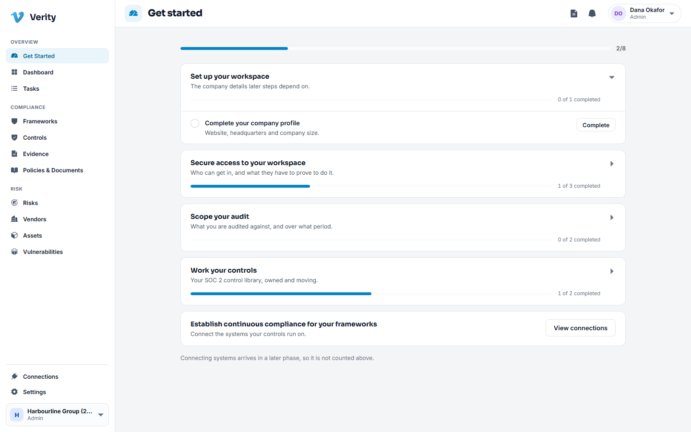

# 1. Getting started

## What Verity is

Verity is where your organisation keeps the evidence that its security promises are
true. One place holds the controls you claim to operate, the proof that each one
works, the policies people have signed, the risks you have accepted, the third
parties you rely on, and the assets and weaknesses underneath all of it.

The job it does for you: when an auditor asks "show me", the answer is a link, not
a week of chasing.

## Signing in for the first time

You will arrive either from an invitation email or from a workspace your
organisation already created.

1. Open the link in your invitation and set a password. It must be at least
   12 characters and mix upper case, lower case, a digit and a symbol. Your
   organisation's administrator can make the rule stricter.
2. Sign in with your work email and that password.
3. If your workspace requires two factor authentication for your role, you will be
   asked to set it up now. Scan the QR code with an authenticator app such as
   1Password, Authy or Google Authenticator, then type the six digit code.
4. Save your recovery codes somewhere safe and offline. They are shown once. If you
   lose your phone, they are how you get back in.

> **If you belong to more than one organisation**, Verity asks which workspace you
> want after you sign in. External auditors and consultants usually see this. You
> can switch later without signing out.

## Get Started

The first screen you land on is a setup checklist that tracks your real progress.

It groups the setup into five pieces: your workspace details, who can get in and
what they must prove, what you are being audited against, working your controls,
and connecting the systems those controls run on. The counter at the top is your
actual state, not a demonstration, and each item links straight to the screen that
completes it.

You can leave it at any time and come back. Nothing expires.

## Your first half hour

You do not have to do everything at once. This order gets you useful fastest.

1. **Look at your controls.** Go to **Controls**. Every workspace starts with the
   full SOC 2 control library already adopted, so this list is not empty. See
   [Frameworks and controls](03-frameworks-and-controls.md).
2. **Give the important ones an owner.** A control with no owner is nobody's job.
   Filter the register by **Owner: None** and work down the list.
3. **Put your people in.** **Settings > Access > People**. Invite the people who
   will own controls, approve policies and answer vendor questions. See
   [Settings and administration](12-settings-and-administration.md).
4. **Load what you already have.** Most teams already keep an asset list and a
   vendor list in a spreadsheet. Import them:
   [Assets](09-assets.md#importing-a-spreadsheet) and [Vendors](08-vendors.md).
5. **Attach your first evidence.** Pick one control you know you operate and attach
   the proof. See [Evidence](04-evidence.md).

## Switching workspace

The workspace switcher sits at the bottom of the left navigation, showing the
organisation name and your role in it. Click it to change workspace. Your session,
your permissions and everything you can see change with it. Nothing you do in one
workspace is visible from another.

## Signing out and sessions

Open the menu on your name, top right, and choose sign out. Sessions expire on
their own after a period of inactivity set by your administrator, so a shared
machine does not stay signed in forever.

## Forgotten password

Use **Forgot password?** on the sign in screen. You will get an email with a reset
link. If two factor authentication is on for your account, you will still be asked
for a code after resetting, and your recovery codes still work.

---

Next: [Finding your way around](02-finding-your-way-around.md)
