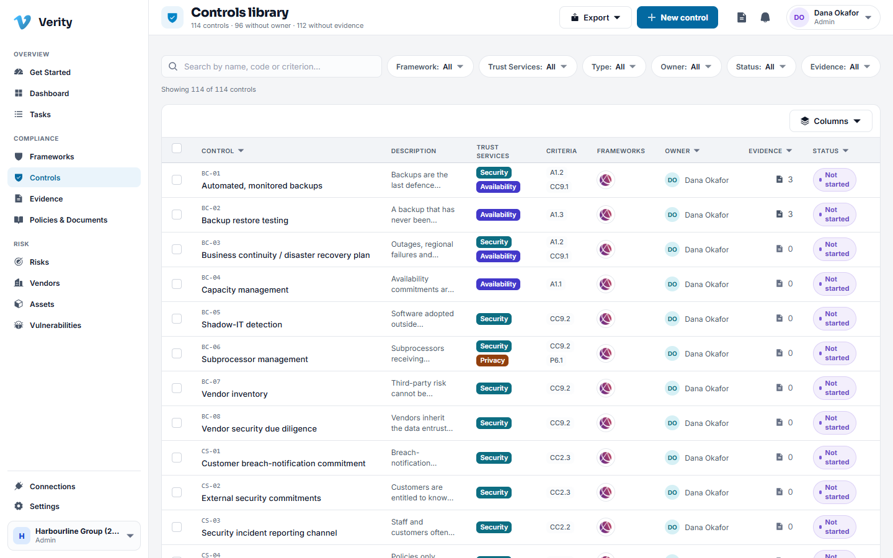
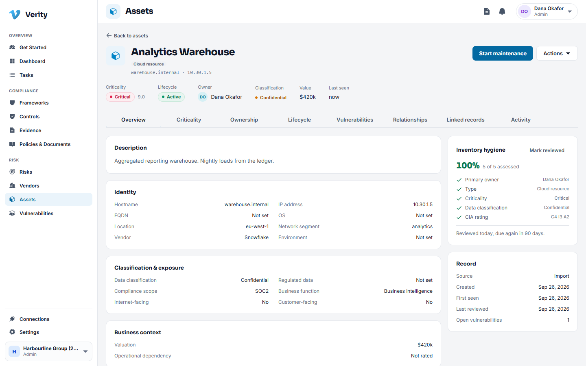

# 2. Finding your way around

Every module in Verity is built from the same four pieces. Learn them once and the
rest of the product reads itself.

## 1. The navigation

The left rail never changes. It is grouped by what you are trying to do:

- **Overview**: Get Started, Dashboard, Tasks.
- **Compliance**: Frameworks, Controls, Evidence, Policies and Documents.
- **Risk**: Risks, Vendors, Assets, Vulnerabilities.
- **Bottom**: Connections and Settings.

Your workspace and role show at the very bottom. Click there to switch workspace.

You only see modules your role allows. If something in this guide is missing from
your navigation, your role does not include it. See
[the permission table](12-settings-and-administration.md#roles-and-what-they-allow).

## 2. The module header

Every module opens on the same pattern: an icon, the module name, a live one line
summary underneath, the buttons for the things you can start here, and a strip of
tabs for the sections inside.

The summary line is real. On Controls it reads like "114 controls, 96 without
owner, 112 without evidence", which is usually the fastest read on where you stand.

Most modules have an **Overview** tab (charts and counts), a **Register** tab (the
list) and, where there is something to configure, a **Settings** tab.

## 3. The register

The list of records. Registers work the same way everywhere:

- **Search** by name or code in the box at the top left.
- **Filters** sit in one row. They narrow the list and stack, so Owner plus Status
  plus Framework is three filters at once.
- **Columns** lets you choose what the table shows. Your choice is remembered.
- **Sorting**: click a column heading. Click again to reverse it.
- **The row menu** (the ⋯ at the end of a row, or an Actions button) holds the
  things you can do without opening the record.
- **Export** produces a spreadsheet of what you are currently looking at, filters
  included.

## 4. The detail page

Clicking a row opens the record. Detail pages share a layout:

- The **header** carries the name, the badges that matter (tier, severity, status)
  and the primary action.
- **Tabs** divide the record. Overview is the summary; the rest are the deep ends.
- The **right hand column** holds the facts that do not change often: ownership,
  dates, where the record came from.
- **Linked records** appears on assets, findings, controls and documents. It
  answers "what else is attached to this" in one place, and you can link something
  new from there.
- **Activity** or **History** is the record's own trail: who changed what and when.

## The things in the top bar

- **The document icon** opens the pending acknowledgements and approvals waiting on
  you personally.
- **The bell** is your notification list: policies to sign, approvals to decide,
  findings escalated to you, tasks that are about to breach their service level.
- **Your name** opens the profile and sign out menu.

## Status, colour and badges

Colour means the same thing everywhere.

| Look | Meaning |
|---|---|
| Green | Passing, active, complete, on track |
| Amber | Needs review, due soon, partially answered |
| Red | Failing, overdue, critical, blocked |
| Grey | Not started, not set, not applicable |
| Violet | Informational, for example the Trust Services category on a control |

A **Soon** badge means the screen is a placeholder for work that is not built yet.
Nothing behind one holds real data.

## When something goes wrong

Verity does not show technical errors. If an action cannot complete you get a plain
sentence explaining what happened and what to do next. If you see a message that
says the request could not be processed and nothing more, that is a bug worth
reporting: note what you were doing and tell your administrator.

---

Next: [Frameworks and controls](03-frameworks-and-controls.md)
