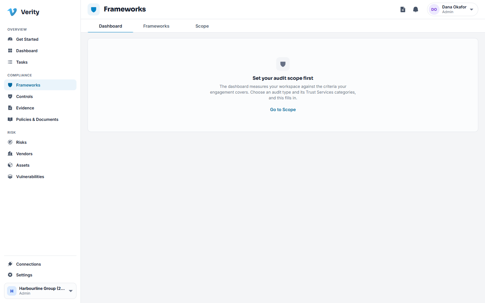
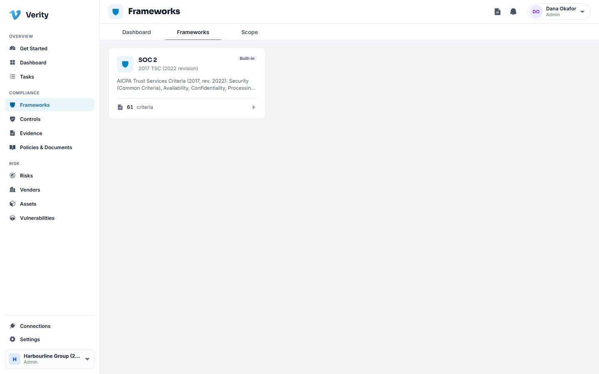
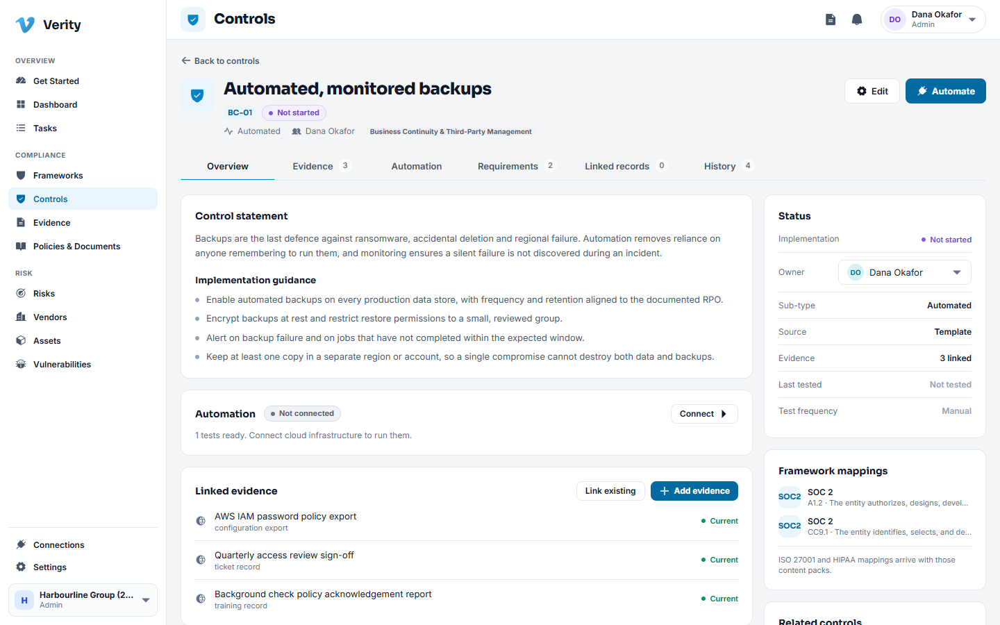

# 3. Frameworks and controls

## What a control is here

A control is something your organisation does to keep a promise: backups run and
are tested, access is removed when someone leaves, changes are reviewed before
release. A framework such as SOC 2 is a list of criteria an auditor will check, and
each control you operate answers one or more of them.

Verity gives every new workspace the whole SOC 2 control library already adopted,
so you start by editing reality rather than building a list from nothing.

## Frameworks

**Frameworks** has three sections.

- **Dashboard** is the posture read: how many controls are passing, which criteria
  are weak, what is in review.
- **Frameworks** lists the frameworks available and which version you are working
  to.
- **Scope** is where you record what is in and out of the audit, and why.

## The controls library

Open **Controls**. The summary line under the title is the fastest read you have:
how many controls exist, how many have no owner, how many have no evidence.

Each row shows the control code and name, the Trust Services categories it serves,
the criteria it maps to, its owner, how many pieces of evidence are attached, and
its status.

**Status** is what your team says about implementation:

| Status | Use it when |
|---|---|
| Not started | Nobody has begun |
| In progress | Work is under way but the control is not operating yet |
| Implemented | The control operates and you can prove it |
| Not applicable | The control genuinely does not apply, with a reason recorded |

### Walkthrough: give a control an owner

1. Go to **Controls**.
2. Set the **Owner** filter to **None**. What remains is every control nobody has
   claimed.
3. Click the control you want to assign.
4. On the **Overview** tab, use the owner picker in the right hand column and
   choose a person.

The owner is a member of this workspace, not an email address. Change of ownership
is recorded in the control's history.

### Walkthrough: work a control end to end

1. Open the control from the register.
2. Read the **statement**: what this control has to achieve. Under it are the
   **guidance steps**, a short recipe for what operating it usually involves.
3. Set the owner and move the status to **In progress**.
4. Go to the **Evidence** tab and attach the proof. See [Evidence](04-evidence.md).
5. When the control genuinely operates and the proof is attached, set the status to
   **Implemented**.

### The tabs on a control

| Tab | What is there |
|---|---|
| Overview | The statement, guidance, owner, status |
| Evidence | Everything attached as proof, and the button to attach more |
| Automation | Checks that a connected system runs for this control on a schedule |
| Requirements | The framework criteria this control answers |
| Linked records | Risks, documents, assets and other records attached to it |
| History | Every change, who made it and when |

## Automation

If your workspace has a connection to a system such as GitHub, some controls can be
checked automatically. The **Automation** tab shows what runs, when it last ran and
what it found, and the output is attached to the control as evidence without anyone
uploading anything. See [Connections](11-connections.md).

## Adding a control of your own

Some controls are yours alone and answer no framework criterion. Use **New control**
at the top of the register. It behaves like any other control, and the register
marks it as custom so an auditor can see which controls came from the shipped
library and which you wrote.

## Retiring a control

Controls are never deleted. Use **Disable** on the control, with a reason. It leaves
the register's active view and keeps its whole history, evidence and mapping, so the
record of what you operated last year survives. **Enable** brings it back.

> **Why not delete?** An audit asks what you were doing in the window under review.
> A deleted control cannot answer that. This is the same rule everywhere in Verity:
> compliance records close, they do not disappear.

---

Next: [Evidence](04-evidence.md)
