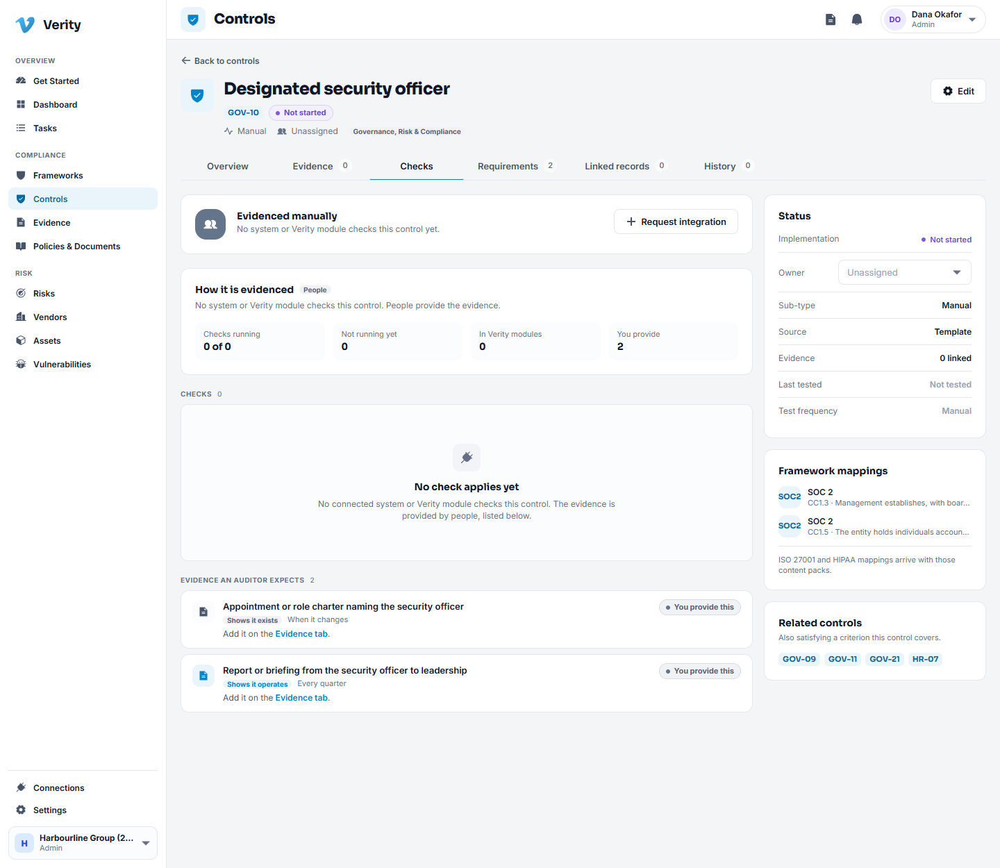
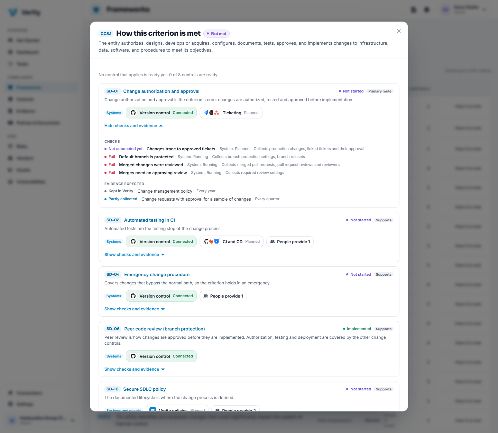
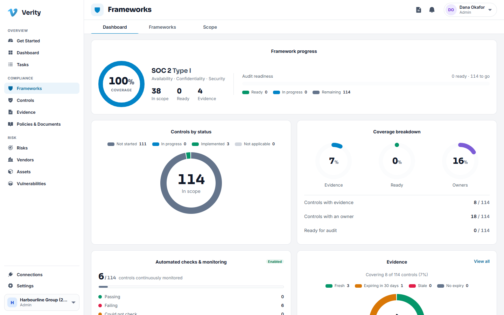

# 3. Frameworks and controls

## What a control is here

A control is something your organisation does to keep a promise: backups run and
are tested, access is removed when someone leaves, changes are reviewed before
release. A framework such as SOC 2 is a list of criteria an auditor will check, and
each control you operate answers one or more of them.

Verity gives every new workspace the whole SOC 2 control library already adopted,
so you start by editing reality rather than building a list from nothing.

## Frameworks

**Frameworks** has three sections.

- **Dashboard** is the posture read: how many controls are passing, which criteria
  are weak, what is in review.
- **Frameworks** lists the frameworks available and which version you are working
  to.
- **Scope** is where you record what is in and out of the audit, and why.

## The controls library

Open **Controls**. The summary line under the title is the fastest read you have:
how many controls exist, how many have no owner, how many have no evidence.

Each row shows the control code and name, the Trust Services categories it serves,
the criteria it maps to, its owner, how many pieces of evidence are attached, and
its status.

Beside each code, small marks say **what evidences the control**: a system such as
GitHub (faded while it is only planned), Verity itself, or people. Hover a mark for
the detail. A word next to them, **Failing** or **Passing**, appears once the checks
have found something.

**Status** is what your team says about implementation:

| Status | Use it when |
|---|---|
| Not started | Nobody has begun |
| In progress | Work is under way but the control is not operating yet |
| Implemented | The control operates and you can prove it |
| Not applicable | The control genuinely does not apply, with a reason recorded |

### Walkthrough: give a control an owner

1. Go to **Controls**.
2. Set the **Owner** filter to **None**. What remains is every control nobody has
   claimed.
3. Click the control you want to assign.
4. On the **Overview** tab, use the owner picker in the right hand column and
   choose a person.

The owner is a member of this workspace, not an email address. Change of ownership
is recorded in the control's history.

### Walkthrough: work a control end to end

1. Open the control from the register.
2. Read the **statement**: what this control has to achieve. Under it are the
   **guidance steps**, a short recipe for what operating it usually involves.
3. Set the owner and move the status to **In progress**.
4. Go to the **Evidence** tab and attach the proof. See [Evidence](04-evidence.md).
5. When the control genuinely operates and the proof is attached, set the status to
   **Implemented**.

### The tabs on a control

| Tab | What is there |
|---|---|
| Overview | The statement, guidance, owner, status |
| Evidence | Everything attached as proof, and the button to attach more |
| Checks | How the control is evidenced: which software runs each check, what it collects, and the evidence people or Verity provide |
| Requirements | The framework criteria this control answers |
| Linked records | Risks, documents, assets and other records attached to it |
| History | Every change, who made it and when |

## Checks and evidence

Few controls are proven by one thing. A change control needs source control settings, a
ticket, a policy and a sample, and those come from different places. The **Checks** tab
says, for each control, where its evidence comes from, so nothing is a surprise at audit.

Read it from the top.

- **How it is evidenced** says who evidences the control: **Systems** (systems and Verity
  check it), **Systems and people** (systems check what they can, people provide the rest)
  or **People**. This is how the control is designed to be evidenced once every planned
  system exists, and it is separate from the control's own Automation field, which says how
  your team operates it. What is running today is stated beside it: "3 of 4 checks
  running", and how many are still planned.
- **The systems** row shows each kind of system the control's checks need and its state
  for you: **Connected**, **Ready to connect**, **Planned** or **Not in plan**. A control
  can need several, for example version control and a ticket system.
- **Checks** lists every check, with the software that runs it. Open one to see what it
  proves for this control and what it does not, the artifacts it collects, which systems
  can run it, and the last result per repository or account. **Part of the control** means
  passing the check verifies part of the control; **Whole control** means it alone verifies
  all of it.
- **Evidence an auditor expects** lists what the control needs shown, and for each item
  where it comes from. **Shows it exists** is design evidence, such as a policy. **Shows it
  operates** is operating evidence, such as a sample of reviewed changes.

Each evidence item says how it gets to the control:

| Label | Means |
|---|---|
| Collected automatically | A running check collects it. Nothing for you to do |
| Partly collected | Running checks collect some of it. Add the rest yourself |
| Collected once connected | A check collects it as soon as you connect the system |
| Provide it for now | A check will collect it when its system is supported. Add it yourself until then |
| Kept in Verity | A Verity module keeps it, and the name links to that module. Verity does not check it yet |
| You provide this | A person provides it. Add it on the Evidence tab |

A control that only people can evidence says so plainly.

If your workspace has a connection to a system such as GitHub, the checks run on a schedule
and their output is attached to the control as evidence without anyone uploading anything.
See [Connections](11-connections.md).

### Walkthrough: see how a requirement is met

1. Go to **Frameworks** and open SOC 2.
2. Find the criterion, for example CC8.1, and choose **How it is met**.
3. Read the controls that answer it. Each shows why it does (**Primary route** or
   **Supports**), what evidences it, and whether it is ready.
4. Choose **Show checks and evidence** on any control to see its checks and the evidence
   behind it.

The same view opens from a control's **Requirements** tab. The criterion is **Met** only when
every control that applies to it is ready, so one finished control never stands in for four
unfinished ones.

## What "ready" means

The dashboard counts controls that are **ready for audit**, and the exported control report
uses the same definition. A control is ready when all three hold:

1. A person has marked it **Implemented**.
2. It has evidence that still counts. Evidence a reviewer rejected does not, and neither
   does evidence past its renewal date: it proves the control worked once, not that it
   works now.
3. No automated test says otherwise. A control with a failing test is not ready however its
   status reads, and neither is one whose tests could not be read, or whose last check is
   more than two days old, because nobody can currently vouch for it.

Automation can only take readiness away. A control no connected system can test, or whose
tests found nothing to check, stays on the manual path and is ready on its status and
evidence alone.

A **criterion** is met only when every control that applies to it is ready. One finished
control standing in for four unfinished ones is the first thing an auditor finds in a sample,
so partial coverage never shows as met. A control marked **Not applicable** is left out of
the criterion; a criterion with no applicable control left is not met, because nothing is
satisfying it.

The **Automated checks & monitoring** card counts controls, rolled up from their tests:
passing, failing, could not check, and not monitored. It reads "Enabled" once a connection
has produced results.

## Adding a control of your own

Some controls are yours alone and answer no framework criterion. Use **New control**
at the top of the register. It behaves like any other control, and the register
marks it as custom so an auditor can see which controls came from the shipped
library and which you wrote.

## Retiring a control

Controls are never deleted. Use **Disable** on the control, with a reason. It leaves
the register's active view and keeps its whole history, evidence and mapping, so the
record of what you operated last year survives. **Enable** brings it back.

> **Why not delete?** An audit asks what you were doing in the window under review.
> A deleted control cannot answer that. This is the same rule everywhere in Verity:
> compliance records close, they do not disappear.

---

Next: [Evidence](04-evidence.md)
