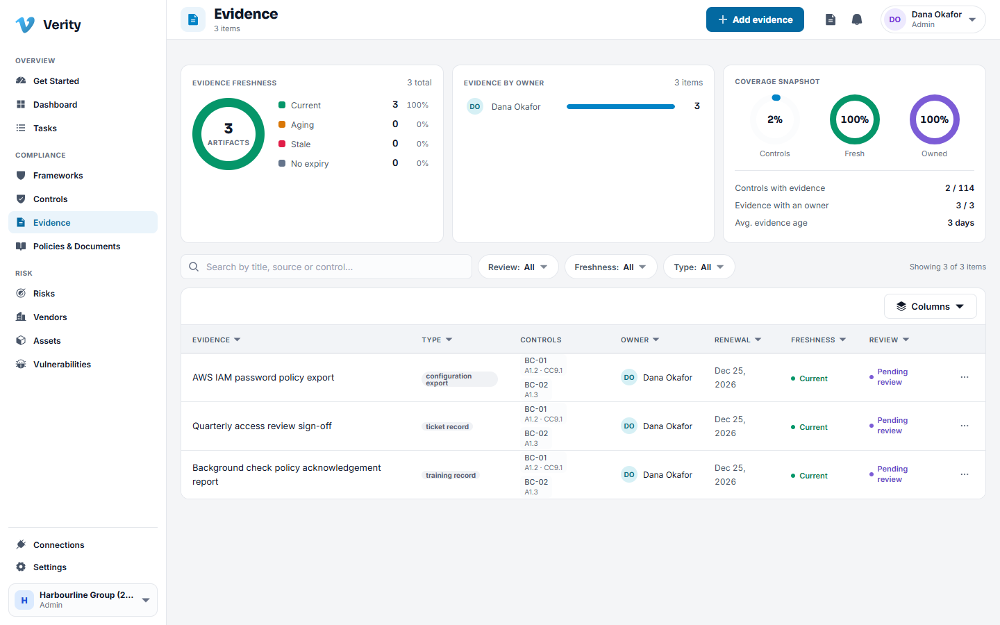
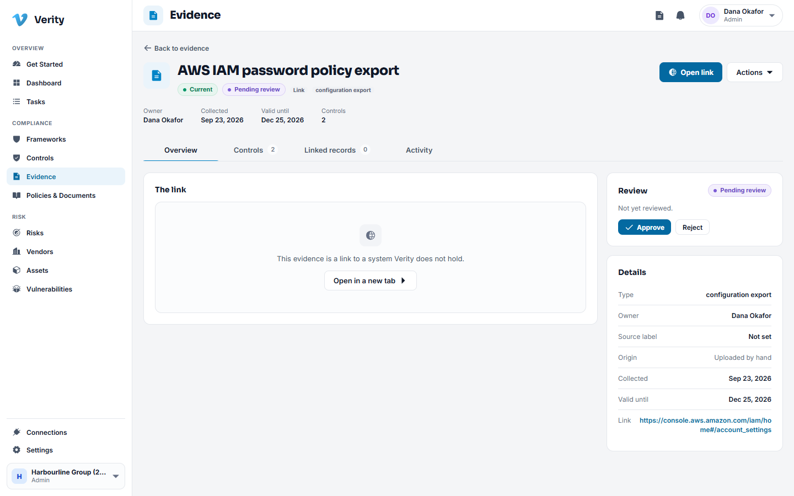

# 4. Evidence

## What evidence is for

A control that nobody can prove is an opinion. Evidence is the artefact that turns
"we do reviews every quarter" into something an auditor can open: the exported
policy, the signed review, the screenshot of the setting, the ticket that shows the
work happened.

## The register

Each row is one artefact: its title, type, who owns it, when it was collected, the
controls it supports, and its freshness.

**Freshness** is the column people miss. Evidence expires. A password policy export
from two years ago proves nothing about today, so every piece of evidence carries a
renewal date and the register shows you what has gone stale.

## Adding evidence

There are two kinds, and the difference matters.

**A file** is a copy Verity holds: a PDF, an export, a screenshot. It cannot change
underneath you, which is exactly what an auditor wants.

**A link** points at something that lives elsewhere: a dashboard, a ticket, a shared
drive. It stays current on its own, but whoever reads it later needs access to that
system.

### Walkthrough: attach evidence to a control

1. Go to **Evidence** and click **Add evidence**, or open the control and use the
   **Evidence** tab so the control is already filled in.
2. Choose whether you are uploading a file or recording a link.
3. Give it a title a stranger would understand. "AWS IAM password policy export,
   September" beats "screenshot 3".
4. Pick the **type**. The type sets a sensible default validity: a configuration
   export is good for 90 days, a policy document for a year, a log export for 30
   days.
5. Set the **owner**: the person who will be asked to refresh it.
6. Attach it to the controls it supports. One artefact usually proves several
   controls, and attaching it once to all of them is correct.
7. Save.

### Walkthrough: use the mapping suggestions

Verity can propose which controls a piece of evidence supports.

1. Open the evidence record.
2. On the **Controls** tab, use the suggest option.
3. You get a list of proposed controls with a reason for each. Nothing is attached
   yet.
4. Approve the ones that are right and ignore the rest.

> **A suggestion is a draft, always.** Nothing Verity proposes is attached to a
> control until a person approves it, and the approval is recorded with your name
> against it. That rule holds everywhere in the product.

## Reviewing evidence

Evidence gets reviewed so somebody other than the person who uploaded it agrees it
proves what it claims.

1. Open the evidence record.
2. Read what is attached and which controls it is said to support.
3. Use **Review** to accept it, or reject it with a reason.

A rejection is not a delete. The artefact stays with the reason attached, so the
next person can see it was considered and why it was not good enough.

## Keeping evidence fresh

1. Filter the register by **Freshness** to find what has expired or is close to it.
2. Each expiring item has an owner. That is who collects the new copy.
3. Attach the new artefact and set a new renewal date. Keep the old one: it proves
   the control was operating in the earlier window, which is exactly what a Type II
   audit examines.

## Where evidence comes from without anyone uploading it

- **Connections.** A connected system runs checks and attaches their output to the
  controls those checks map to. See [Connections](11-connections.md).
- **Other modules.** A published policy, a completed task and a vendor's SOC 2
  report can all act as evidence for the control they serve.

---

Next: [Policies and documents](05-policies-and-documents.md)
