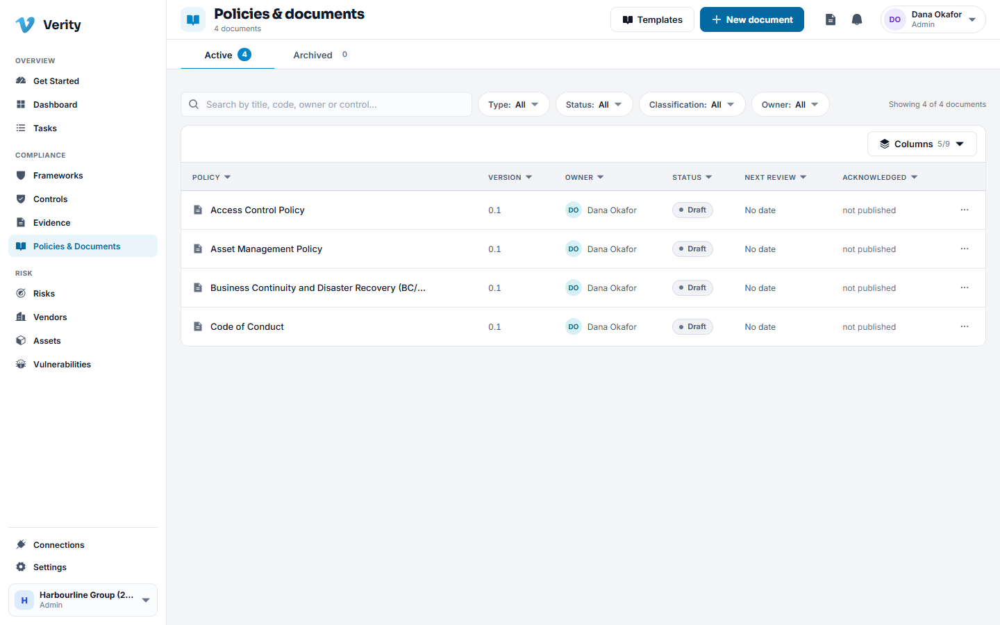
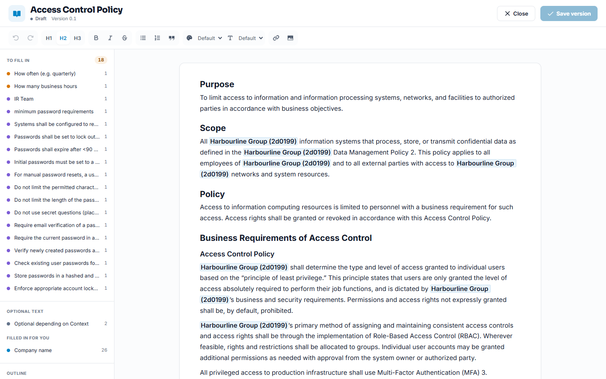
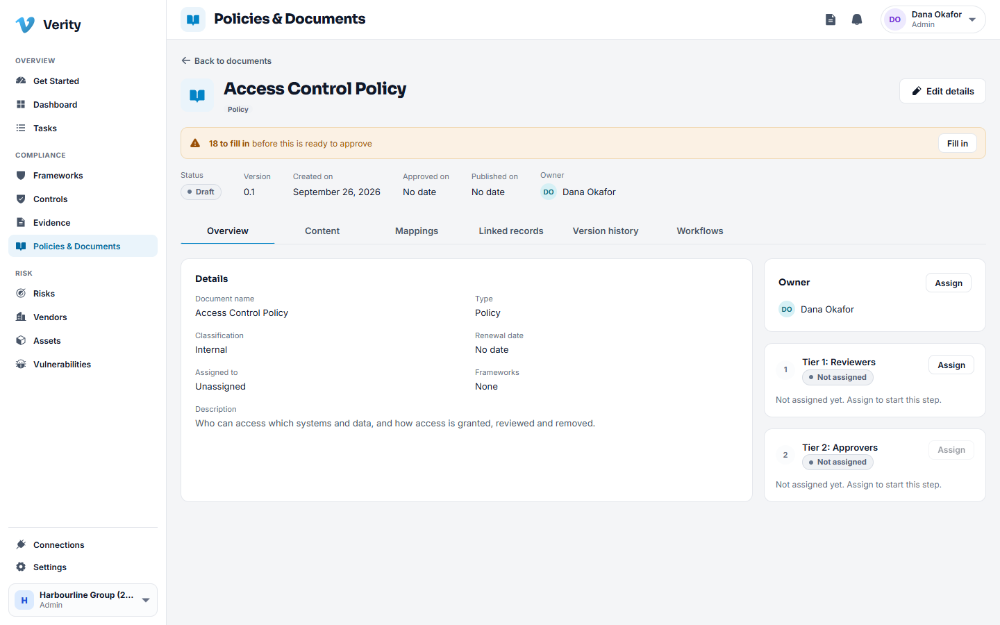

# 5. Policies and documents

## What this module holds

Your written commitments: policies, standards, procedures, guidelines and charters.
Verity keeps the text, the version history, who approved each version, and who has
read and signed it.

## The life of a document

| State | What it means |
|---|---|
| Draft | Being written. Nobody outside the authors needs to see it |
| Needs approval | Sent for sign off and waiting on a decision |
| Approved | Every required approver said yes, not yet published |
| Published | Live. This is the version people are held to |
| Expired | Its review date passed without a new version |
| Archived | Retired on purpose, kept for the record |

A published document is never deleted. It is archived, and the text stays readable,
because an auditor will ask what your policy said during the period under review.

## Creating a document

You have three ways in, all from **New** on the register.

1. **From a template.** Verity ships a library of policy templates. Pick one and you
   get a complete draft in your workspace's name, ready to edit. This is the fastest
   route and the one most teams should use.
2. **From scratch.** A blank document with the same metadata.
3. **Upload a file.** If your policy already exists as a PDF or Word file, upload it.
   Everything else (approval, publishing, acknowledgement) works the same way.

### Walkthrough: draft a policy from a template

1. Go to **Policies and Documents** and click **New**.
2. Choose the template, for example Access Control Policy.
3. Set the **owner**: the person accountable for the content, not necessarily the
   author.
4. Set **classification** (internal, confidential, and so on) and the **review
   cadence**, which is how often this document must be revisited.
5. Save. You now have a draft with its own code, for example POL-004.

## The editor

Open the document and use **Edit** to open the full screen editor.

It is a normal rich text editor: headings, lists, tables, links. Two things are
worth knowing.

- **Every save makes a version.** You can compare any two versions and restore an
  earlier one. Nothing is lost by saving often.
- **A change is major, minor or patch.** You choose when you save. Major means
  people need to read it again, and that choice drives whether a new acknowledgement
  is expected.

## Mappings

The **Mappings** tab connects the document to the frameworks and controls it
satisfies. Use **Link controls** and pick the frameworks and controls. That link is
what lets a policy stand as evidence for a control.

## Approval

Approval in Verity is tiered. A tier is one round of sign off, and each tier can
name people, roles or groups.

- Assign a **named person** and that person must decide.
- Assign a **role or group** and any one member of it can decide on behalf of all.
- More than one tier runs in order: tier 2 opens only when tier 1 has cleared.

### Walkthrough: send a policy for approval

1. Open the document and go to **Workflows**.
2. On tier 1, choose who approves: a person, a role such as Security Officer, or a
   group.
3. Assigning tier 1 starts the workflow and notifies the people in it. There is no
   separate send button.
4. Each approver gets a notification and a dedicated review page. They read the
   document and type approve or reject to confirm the decision.
5. When the last required decision lands, the document is published automatically.

> **A rejection needs a reason.** It goes back to the owner with the reason
> attached, so the next draft can answer it.

## Acknowledgement campaigns

Publishing is not the same as people having read it. A campaign asks named people to
read and sign.

### Walkthrough: run an acknowledgement campaign

1. Open the published document.
2. Use **Start an acknowledgement campaign**.
3. Choose who must acknowledge. You can target individual people, whole roles or
   groups, and mix them.
4. Set a due date and send.
5. Each recipient gets a notification and a read and sign page. They cannot sign
   until they have opened the document.
6. Track progress from the campaign page: who has signed, who has not, with a
   reminder you can send.

The campaign's record is the evidence: an auditor asking "how do you know staff read
the policy" gets a list of names, dates and versions.

## Reviews and expiry

A document with a review cadence gets a next review date. As it approaches, the
owner is reminded. If the date passes with no new version, the document moves to
**Expired**, which is visible in the register. Expired is not archived: the text is
still live, it is just overdue.

---

Next: [Tasks](06-tasks.md)
