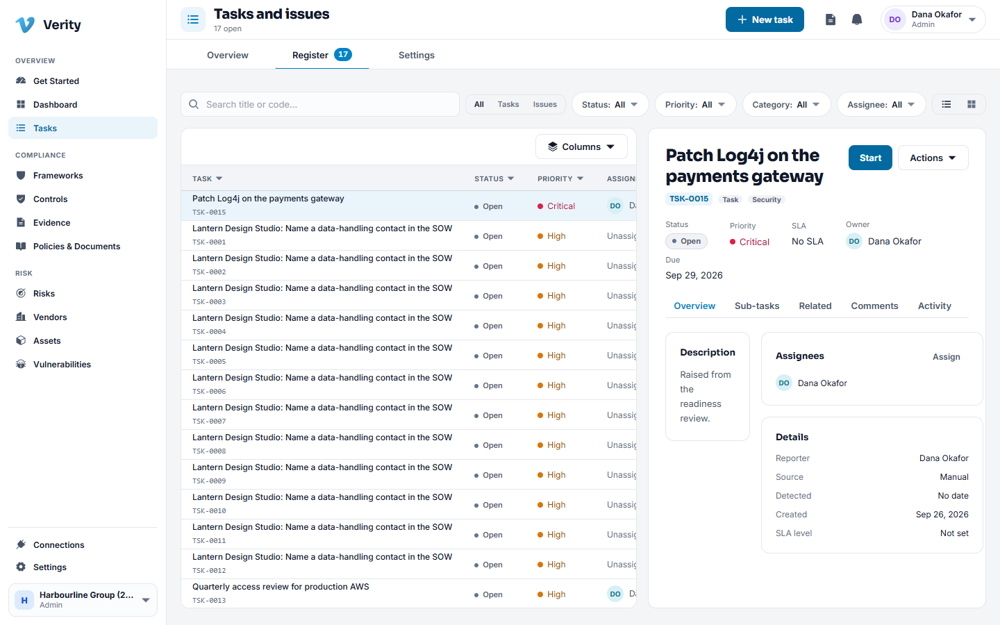
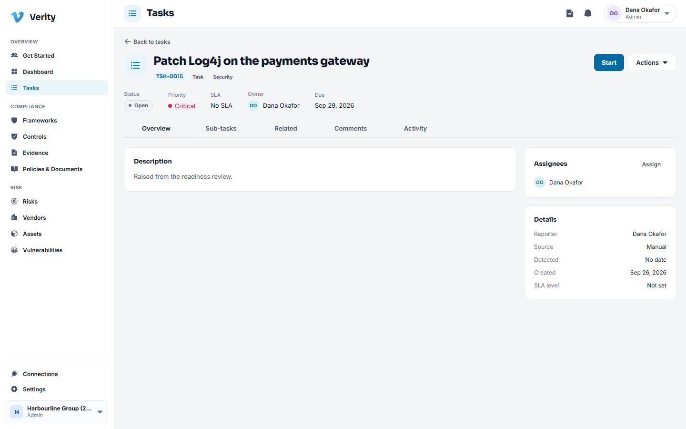
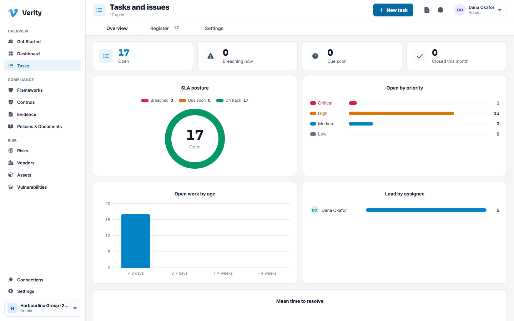
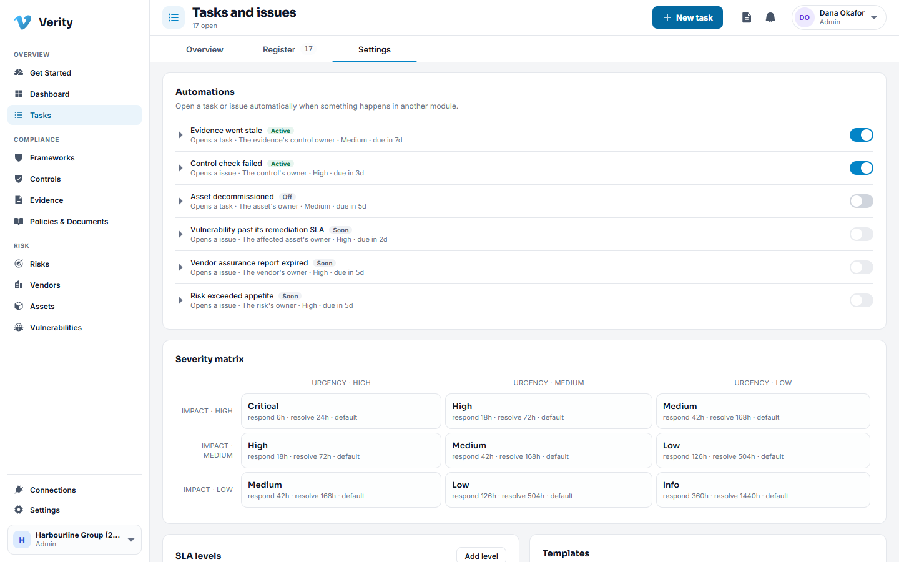

# 6. Tasks

## What tasks are for

Everything in Verity eventually becomes work somebody has to do: collect this
evidence, review that access list, fix the finding, update the policy. Tasks are
where that work is assigned, tracked and closed.

## Tasks and issues

Two kinds share one register.

- A **task** is planned work. It has an owner and a due date.
- An **issue** is something that went wrong. It carries a severity, and it can hold
  corrective and preventive actions underneath it.

The difference matters for an auditor: issues show that when something broke, you
noticed, acted, and can show the actions you took.

## States

| State | Meaning |
|---|---|
| Open | Raised, not started |
| In progress | Being worked |
| Blocked | Waiting on something outside the owner's control |
| Under review | Done in the owner's view, waiting on a check |
| Closed | Finished |
| Cancelled | Dropped on purpose, with a reason |

## Walkthrough: raise and assign a task

1. Go to **Tasks** and click **New task**.
2. Give it a title that says what done looks like: "Collect the Q3 access review
   sign off from IT" rather than "access review".
3. Choose a **category** (security, privacy, operations, data, regulatory, vendor
   or other) and a **priority**.
4. Set the **owner**, who is accountable, and **assignees**, who do the work. They
   are often the same person.
5. Set a **due date**.
6. Save. The assignees are notified.

## Walkthrough: work and close a task

1. Open the task from the register or from your notifications.
2. Move it to **In progress** using the status control in the header.
3. Use **Comments** to keep the conversation in one place. Comments are part of the
   record.
4. Attach whatever you produced: a file, a link, or a piece of evidence.
5. Move it to **Under review** if somebody else checks it, or straight to **Closed**
   if not.

Every transition is recorded with the person and time in the **Activity** tab.

## Service levels

A service level is a promise about how quickly work of a given priority gets done.
Tasks that breach one are visible, escalated and countable, which is what turns
"we fix critical issues quickly" into something you can show.

The **Overview** tab shows how you are doing against them.

## Approvals

Some work should not be closed on the word of the person who did it. A task can
require approval: it moves to **Under review**, the approver gets a notification and
decides, and their decision is recorded.

## Corrective actions on an issue

Open an issue and use the **Actions** tab. Each action has its own type, owner and
state:

- **Containment**: stop the bleeding now.
- **Corrective**: fix the thing that broke.
- **Preventive**: stop it happening again.
- **Verification**: check the fix actually worked.

An action can be promoted to a task of its own when it turns out to be a piece of
work in its own right.

## Sub-tasks and related records

- **Sub-tasks** break a large task into steps that can be assigned separately.
- **Related** shows what this task is attached to: the control, the finding, the
  vendor or the document that caused it.

## Settings

**Tasks > Settings** is where an administrator sets the service level targets, the
severity matrix (how impact and urgency combine into a severity) and the automation
rules that raise tasks on their own.

---

Next: [Risks](07-risks.md)
