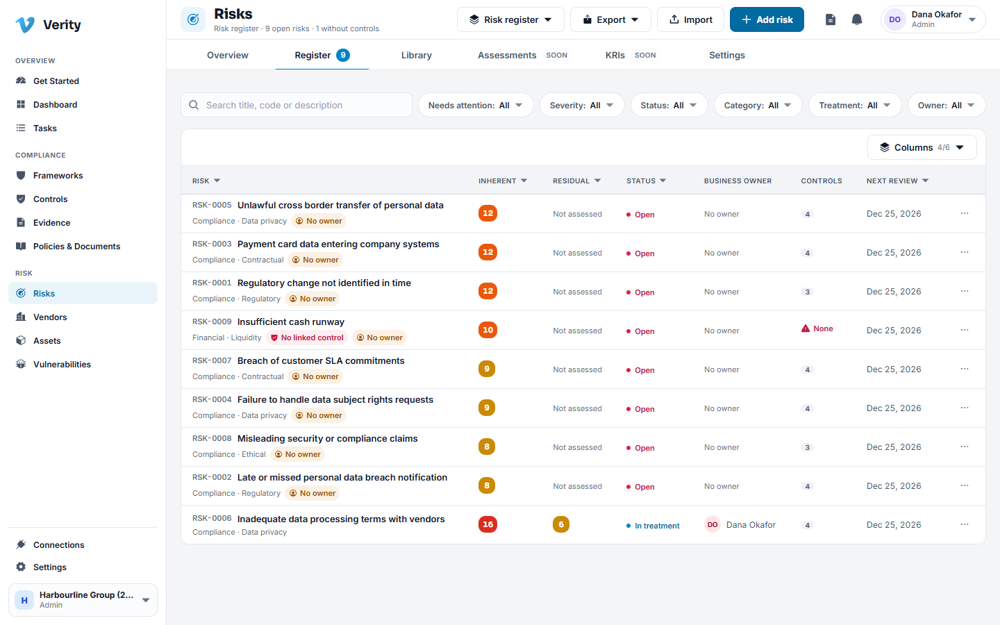
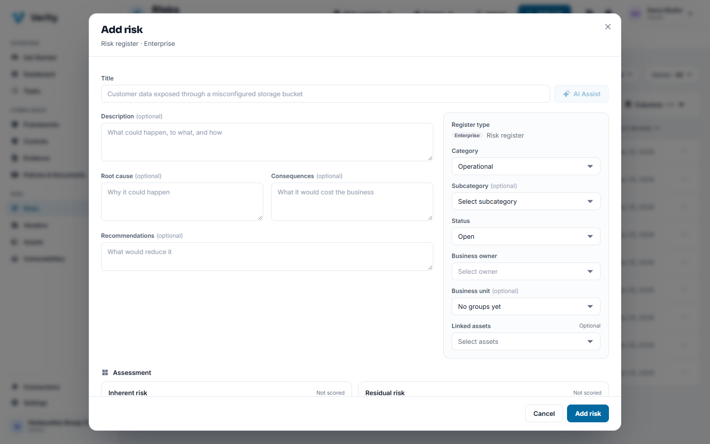
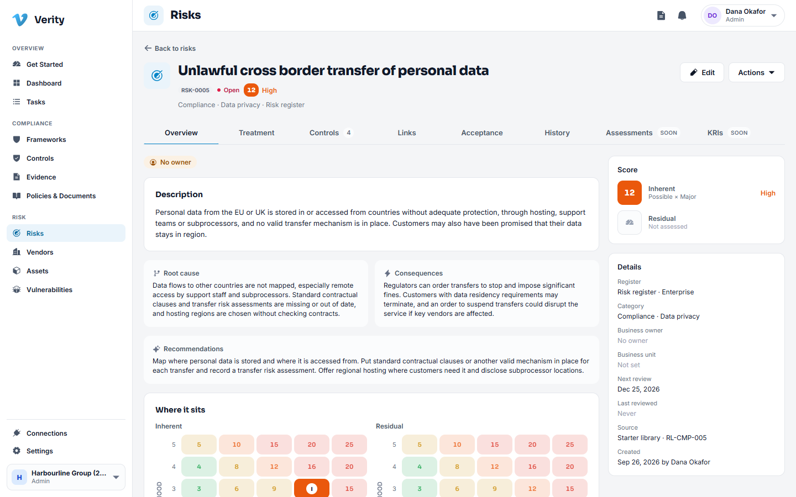
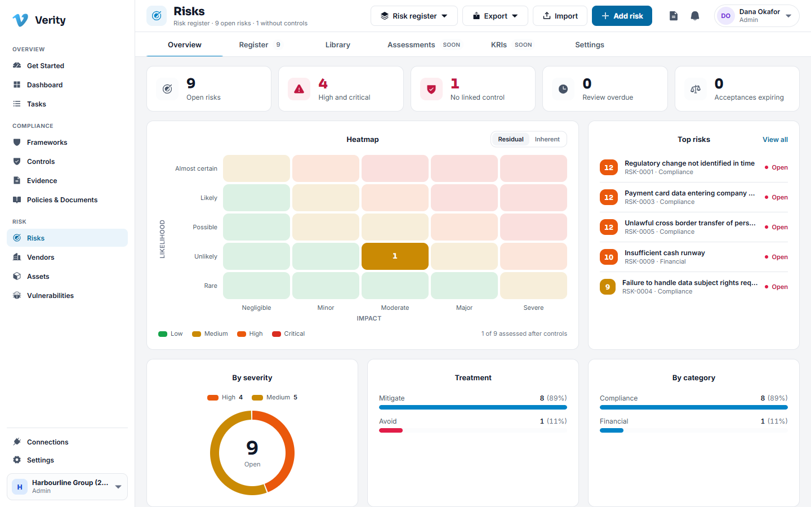
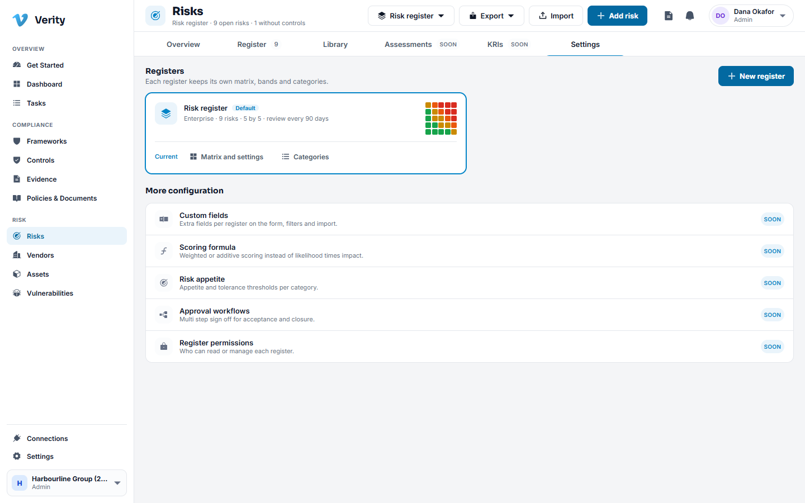

# 7. Risks

## What a register is

A risk register is a list of things that could go wrong, scored so you can argue
about the right ones. Verity supports more than one register, because an operational
risk register and a project register usually want different scales and different
owners.

Each register owns its own:

- **Scoring matrix**: the likelihood and impact scales, and what counts as low,
  medium, high or critical.
- **Taxonomy**: the categories and subcategories risks are filed under.
- **Review cadence**: how often a risk in it must be revisited.

## Scoring: inherent and residual

Every risk carries two scores.

- **Inherent** is the risk before your controls do anything.
- **Residual** is what is left once they do.

Both are likelihood times impact on the register's scale. The gap between them is
the argument for the controls you operate, which is exactly what an auditor is
looking for.

## Walkthrough: add a risk

1. Go to **Risks** and click **Add risk**.
2. Write the **title** as a sentence with a consequence: "Customer data exposed
   through a misconfigured storage bucket" rather than "S3".
3. Use **AI Assist** if you want a starting draft. It proposes a category,
   description, root cause, consequences, recommendations and an opening score.
   Nothing it suggests is applied until you click to use it, field by field or all
   at once.
4. Choose the **category** and subcategory.
5. Score the **inherent** risk, then the **residual** risk.
6. Pick a **treatment**: mitigate, accept, avoid or transfer.
7. Set the **business owner** and a **treatment due date**.
8. Save.

## The states a risk moves through

| State | Meaning |
|---|---|
| Open | Recorded, not being treated yet |
| In treatment | Work is under way to reduce it |
| Mitigated | Treated down to its residual level |
| Accepted | Consciously tolerated, with an approval behind it |
| Closed | No longer relevant |

## Walkthrough: treat a risk

1. Open the risk and go to **Treatment**.
2. Write the plan: the steps, who owns them and by when.
3. Raise the actions as tasks so the work is tracked where all other work lives.
4. On the **Controls** tab, attach the controls that reduce this risk. That link is
   what makes your control library an answer to your risk register rather than a
   separate exercise.
5. As the work lands, update the residual score.

## Walkthrough: accept a risk

Acceptance is the formal act of saying "we will live with this". It is separated
from the rest of the record on purpose.

1. Open the risk and go to **Acceptance**.
2. Request acceptance: state the justification, the compensating measures and an
   expiry date.
3. Somebody other than the requester decides. Verity refuses to let the same person
   both request and approve.
4. On approval the risk moves to **Accepted** and carries its expiry.
5. When the expiry passes, the acceptance lapses and the risk reopens on its own,
   so a decision made two years ago does not quietly become permanent.

> **Acceptance has an owner and an end date, always.** That is the difference
> between an accepted risk and an ignored one.

## The library and importing

- **Library** is a catalogue of common risks, already written and scored, that you
  can adopt into a register. Faster than staring at an empty page, and you can edit
  anything you adopt.
- **Import** takes a spreadsheet. Download the template, fill it in, preview what
  Verity read, then commit. The preview is where you catch a column that mapped to
  the wrong field.

## Risks raised from elsewhere

A risk can arrive from another module:

- From a **vendor finding**: a weakness in a third party that you decide to carry as
  your own risk.
- From an **assessment** or an **import**.

The register records where each risk came from, so "who raised this and why" is
always answerable.

## Settings

**Risks > Settings** is where an administrator manages registers: the scales, the
bands, the categories and the review cadence.

Tabs marked **Soon**, such as Assessments and KRIs, are placeholders for later work.

---

Next: [Vendors](08-vendors.md)
