# 8. Vendors

## What this module does

Third party risk, end to end. Who you rely on, how much of your exposure sits with
each one, what you asked them, what they answered, what you found, what you are
doing about it, and what happens when the relationship ends.

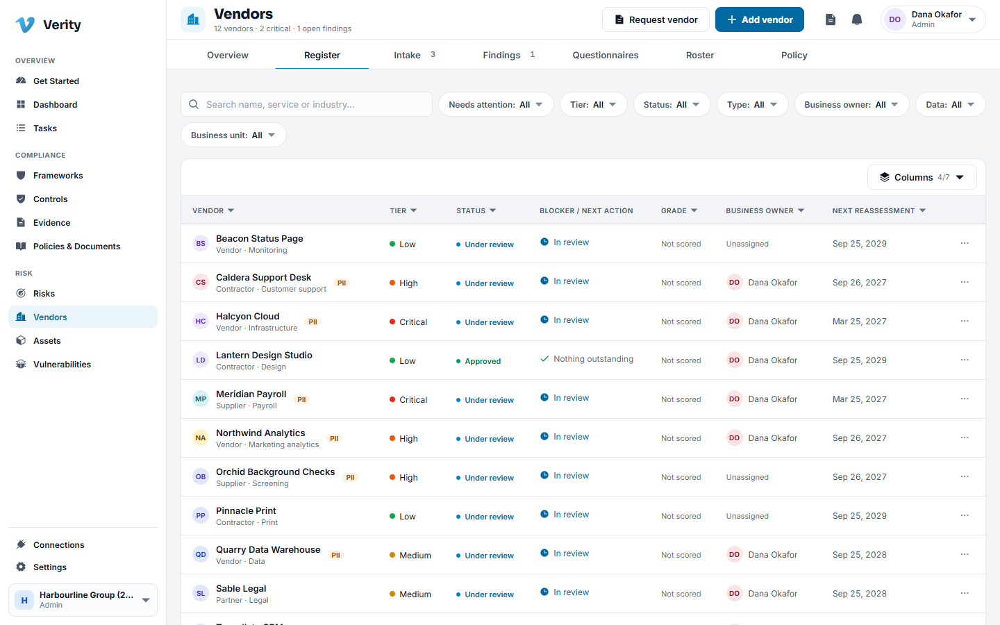

## The shape of it

- A **vendor** is the organisation.
- An **engagement** is one thing you use them for. A vendor can have several, and
  each is assessed on its own, because hosting production is not the same risk as
  running a design project.
- The **lifecycle** runs on the engagement, in twelve stages.

## The twelve stages

| Stage | What happens |
|---|---|
| Intake | Somebody asks for the vendor, and the request is decided |
| Tiering | Five questions set how much diligence this engagement earns |
| Diligence | Reviewers are assigned and the paperwork is gathered |
| Questionnaire | The vendor answers, usually through the portal |
| Scoring | Their answers become a residual score and a grade |
| Findings | Gaps become findings with owners and due dates |
| Contracting | The contract, the DPA, the renewal terms |
| Approval | The gate: somebody accountable says yes or no |
| Onboarding | Access is granted and the relationship starts |
| Monitoring | Signals, alerts and document expiry are watched |
| Reassessment | The whole thing comes round again on a cadence |
| Offboarding | Access is revoked, data is returned or destroyed |

Stages do not skip. The workspace can mark a stage not applicable through policy,
and the record shows it was skipped by policy rather than forgotten.

## Getting a vendor into Verity

There are two doors, and which one you use depends on who you are.

### Anyone: request a vendor

If you can see the vendor register you can ask for a new vendor. You are not
creating one.

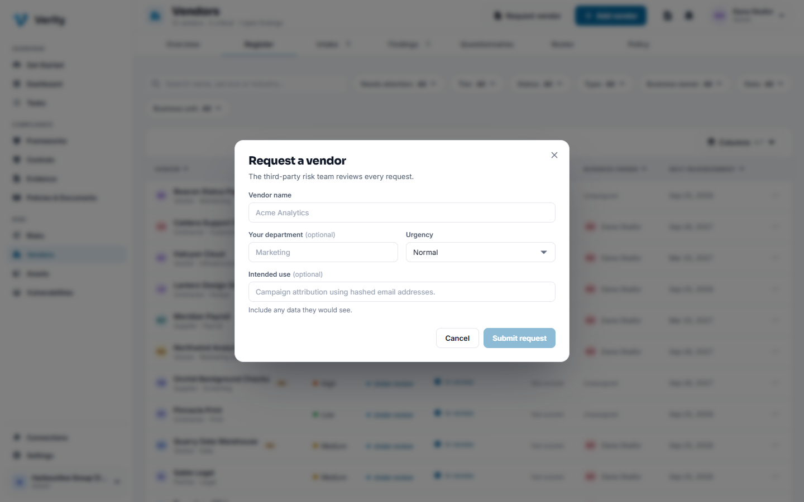

1. Click **Request vendor** in the header.
2. Give the vendor's name, your department, what you want them to do, and how urgent
   it is.
3. Submit. Verity checks the name against the register. If it looks like a vendor
   you already use, the dialog stays open and shows you which, before anyone
   reviews it.

The request lands in **Vendors > Intake**. Nothing is in the register yet.

### The third party risk team: add a vendor directly

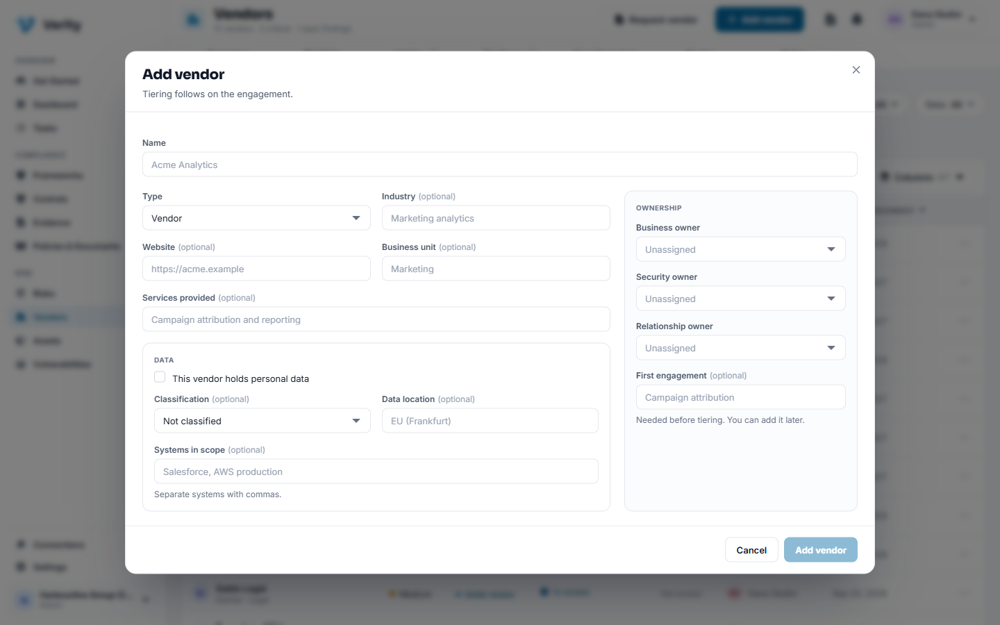

1. Click **Add vendor**.
2. Fill in the name, type, industry, website and business unit.
3. Record what data they touch: whether they hold personal data, the
   classification, where it lives, which systems are in scope.
4. Name the three owners: business, security and relationship.
5. Name the **first engagement**. This is what gets tiered.

### Walkthrough: decide an intake request

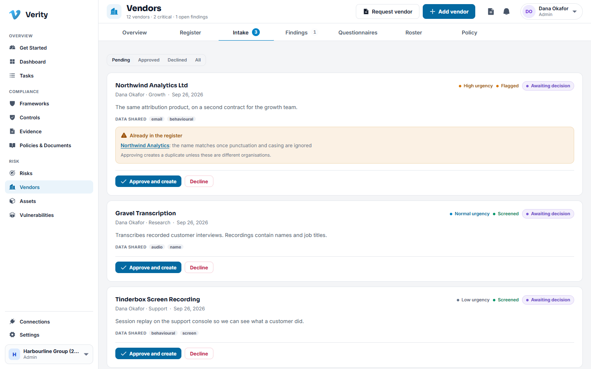

1. Go to **Vendors > Intake**. Pending requests sort first, and the tab carries a
   count of what is waiting.
2. Read the request. If screening flagged possible duplicates, the matching vendors
   are listed with links.
3. **Approve** creates the vendor and its first engagement and takes you to it.
4. **Decline** requires a reason. Nothing is created, and the reason is kept.

> **You cannot decide the same request twice**, and a decline cannot be undone. If
> circumstances change, raise a new request so the history shows both decisions.

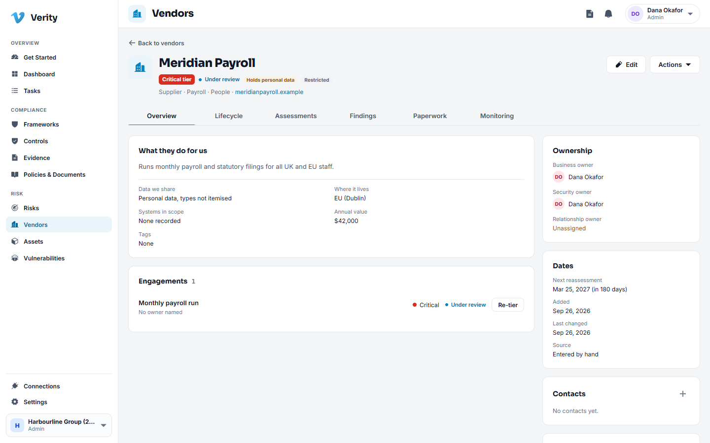

## Tiering

Tiering decides how much diligence this engagement earns. Five questions, each
scored 0 to 4:

1. **Data sensitivity**: what they hold.
2. **Business criticality**: what breaks if they stop.
3. **System access**: how far into your estate they reach.
4. **Regulatory scope**: whether regulators care about this relationship.
5. **Fourth party reliance**: who they in turn depend on.

The answers are weighted and produce a band: **Low**, **Medium**, **High** or
**Critical**. The tier drives the questionnaire the vendor is sent, the reassessment
cadence, and how strict the approval gate is.

### Walkthrough: tier an engagement

1. Open the vendor and go to **Lifecycle**.
2. Open the **Tiering** stage and answer the five questions.
3. Save. The tier appears on the vendor header and on the engagement, and the
   twelve stages are planned.

**Re-tiering** later is allowed and honest about its consequences: if the new tier
demands work the old one skipped, the affected stages reopen.

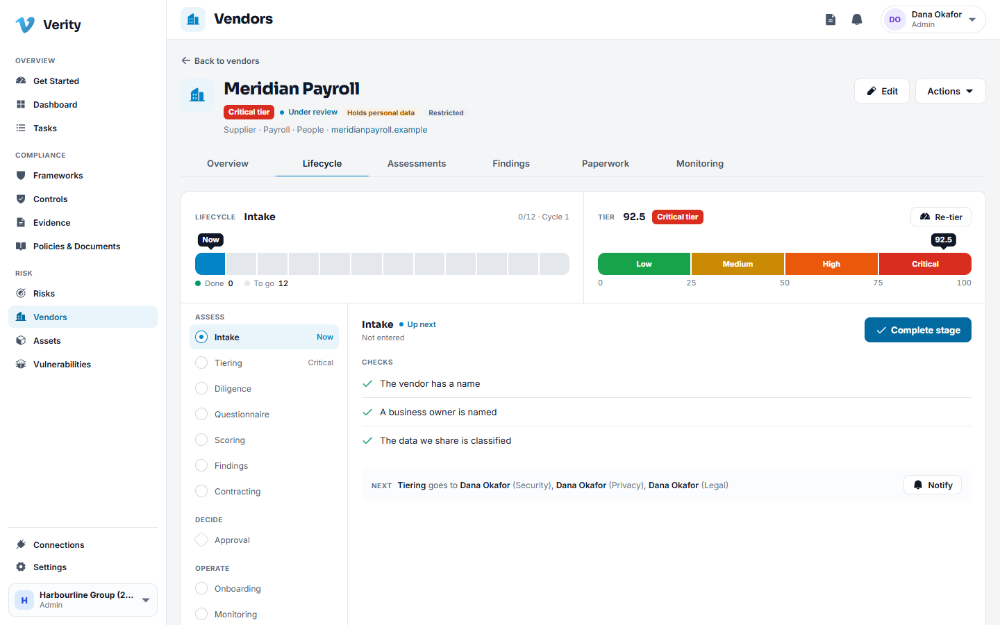

## Questionnaires and the vendor portal

Your workspace builds its own questionnaires. **Vendors > Questionnaires** holds
them, with a library to start from.

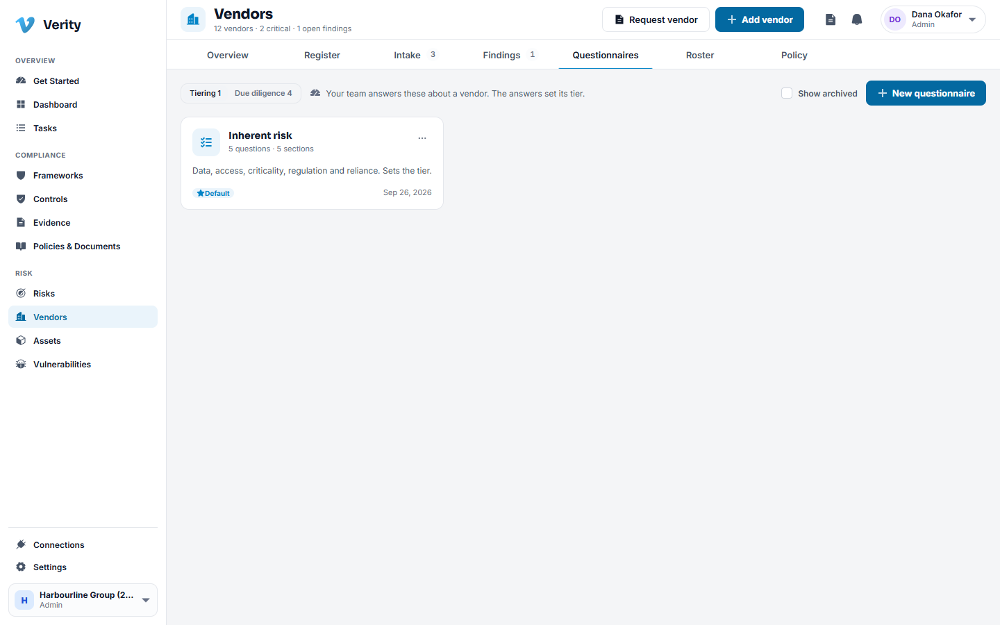

Two purposes:

- **Tiering questionnaires** are answered by your team, about the vendor.
- **Due diligence questionnaires** are answered by the vendor, and drive the
  residual score and the findings.

### Walkthrough: send a questionnaire to a vendor

1. Open the vendor and add a **portal contact** with an email address.
2. Go to **Lifecycle > Questionnaire** and dispatch the questionnaire for this
   engagement.
3. Verity produces a single use portal link. Send it to the contact.
4. The vendor opens the link with no account and no password, answers the
   questions, attaches files, and saves as they go.
5. You watch progress from the **Assessments** tab.

> **The link is shown once.** Verity keeps only a hash of it, so it cannot be
> recovered later. If it is lost, issue a new one.

## Assessment, scoring and review

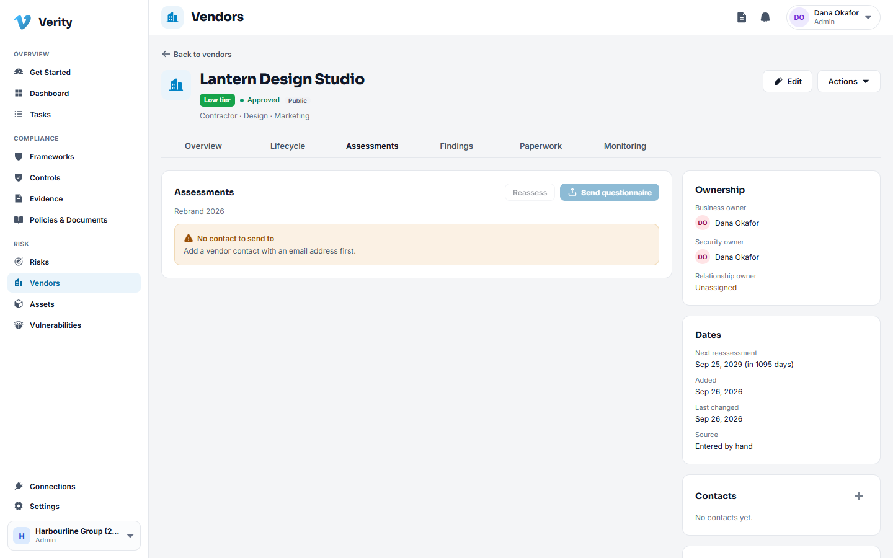

When answers come back, the assessment produces a **residual score** and a letter
grade from A to F. A control the vendor does not have caps the score, and a missing
critical control puts a floor under the risk no matter how well they answer
everything else.

Reviews can be shared. Assign a domain of the questionnaire, or the whole review, to
a colleague. Each assignment has its own state, and comments can be internal or
shared with the vendor. The vendor sees only shared comments.

## Findings

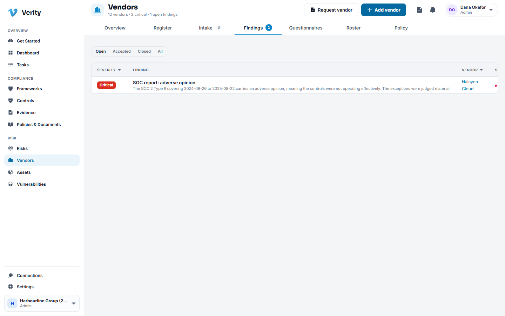

A gap becomes a finding: a severity, an owner, a due date driven by your policy, and
a state. Findings can also be raised by hand, because not everything you learn comes
from a questionnaire.

Your options on a finding:

- **Remediate**: the vendor fixes it, you verify and close.
- **Accept**: you tolerate it, with a justification and an expiry date. When the
  expiry passes the finding reopens on its own.
- **Raise a risk**: promote it to your own risk register.

## The approval gate

Approval is the one stage that is a gate. Verity refuses to let it clear while:

- any earlier stage is still open,
- any critical or blocking finding is open, on this engagement or vendor wide,
- the required reviewers have not been assigned.

Separation of duties applies: the person who requests approval cannot be the person
who grants it. The gate clears itself as soon as the thing blocking it is resolved,
so you do not have to remember to come back and unstick it.

## Contracts and paperwork

The **Paperwork** tab holds contracts, DPAs, SOC 2 reports, certificates and your
service level agreements. Each document carries an expiry, and expiring paperwork
appears in monitoring before it lapses rather than after.

## Monitoring

The **Monitoring** tab is the ongoing view: signals you record about the vendor (an
outage, a breach report, a news item), alert rules that decide what a signal sets
off, and the reassessment clock.

An alert rule can notify someone, raise a task, or bring the reassessment forward to
today.

## Shadow IT

Software that arrived without going through intake. Record a discovered app, then
triage it: add it as a vendor (which raises an intake request), link it to a vendor
you already have, or ignore it with a reason.

## Offboarding

Ending a relationship is a stage, not a delete.

1. Open the vendor and start offboarding.
2. Work the checklist: revoke access, confirm data return or destruction, close
   contracts, settle invoices.
3. Portal tokens are revoked as soon as offboarding starts.
4. The vendor moves to archived when every exit check is complete, and the whole
   record stays readable.

## Policy

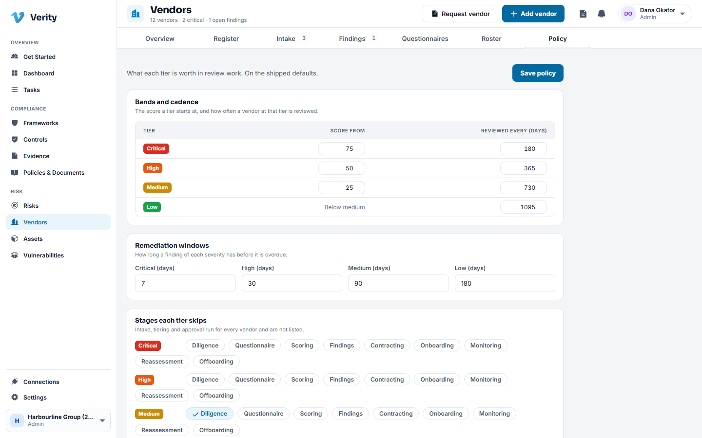

**Vendors > Policy** is where an administrator sets the rules the module runs on:
the tiering bands, reassessment cadences per tier, the remediation window for each
finding severity, which stages a tier may skip, and which roles must review.

Change the policy and new work follows the new rules. Work already under way keeps
the policy it started under, so a vendor assessed last quarter can still be
explained.

## Overview

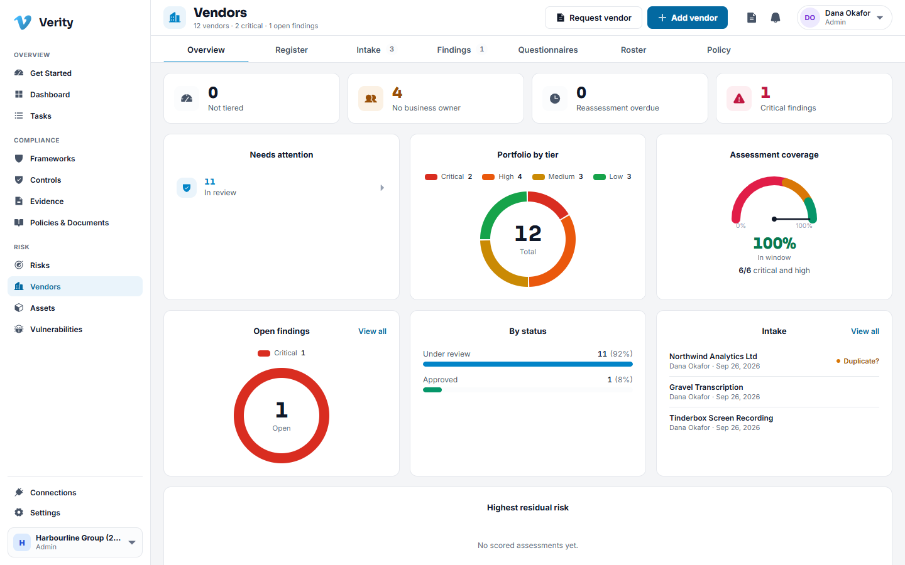

The **Overview** tab is the portfolio read: vendors by tier, what is awaiting a
decision, open findings by severity, and what is due for reassessment.

---

Next: [Assets](09-assets.md)
