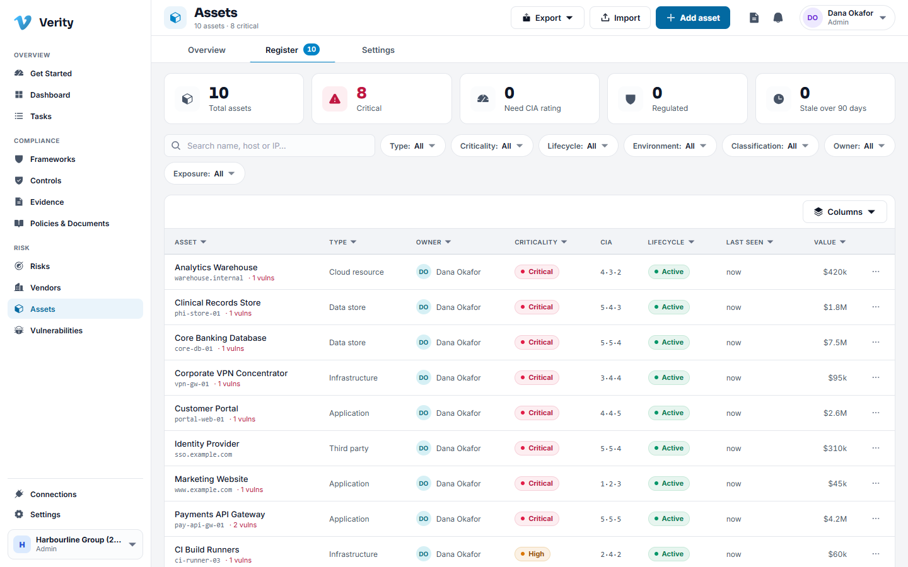
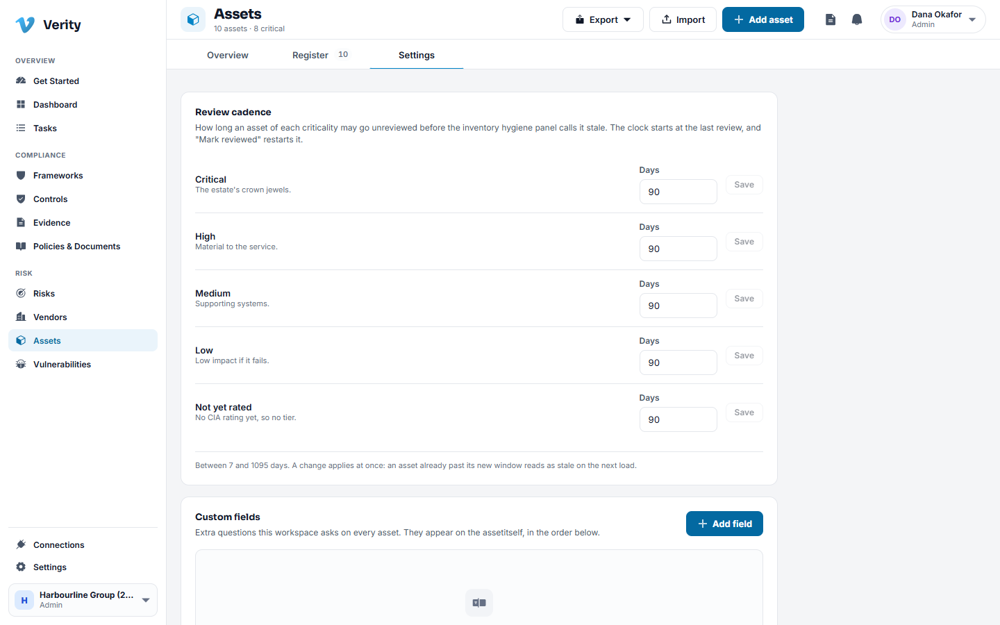
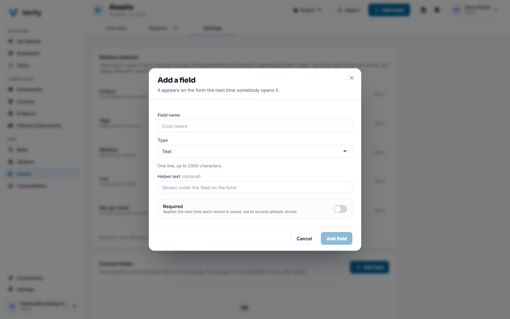
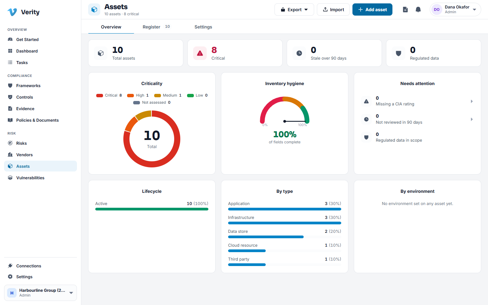

# 9. Assets

## What the inventory is for

You cannot protect what you cannot list. The asset inventory is the record of what
you run, how important each thing is, who owns it, and what depends on what. Every
other module leans on it: a vulnerability is a weakness *on an asset*, a risk is
usually about *an asset*, an auditor's first question about scope is *which assets*.

## What counts as an asset

Six types: application, infrastructure, data, cloud resource, third party and
business service. If it processes, stores or carries something you care about, it
belongs here.

## Walkthrough: add an asset

1. Go to **Assets** and click **New asset**.
2. Name it as your team refers to it: "Payments API Gateway", not "prod-01".
3. Set the **type** and describe what it does in one sentence.
4. Fill in identity where you know it: hostname, IP address, location, environment,
   operating system.
5. Record **classification and exposure**: the data classification, whether it is
   internet facing, whether it is customer facing, its network segment, its business
   function.
6. Rate **confidentiality, integrity and availability** from 1 to 5. See below.
7. Name the **owners**.
8. Save.

## Criticality: how the tier is derived

You do not type a criticality. You rate the asset on three axes and Verity derives
the tier:

- **Confidentiality**: how bad is disclosure.
- **Integrity**: how bad is silent corruption.
- **Availability**: how bad is downtime.

Exposure raises it: internet facing and customer facing assets score higher, and so
does one carrying regulated data. The result is a score out of 10 and a tier of
low, medium, high or critical.

If the derived tier is wrong for a reason a formula cannot see, you can **override**
it, but the override asks for a reason and the record keeps both numbers. An auditor
can see what the system derived and what a human decided.

> **Not rated is not medium.** An asset with no CIA rating has no tier at all, and
> shows as unassessed. Verity will not invent a middle value for you.

## Inventory hygiene

The panel on the right of every asset is the completeness score. Five checks, each
worth twenty points:

1. Primary owner
2. Type
3. Criticality
4. Data classification
5. CIA rating

Each is listed with a tick or a warning and what it found, so a score of 100 per
cent is checkable rather than asserted. Under them is the freshness line: when the
asset was last reviewed and when it is due again.

**Mark reviewed** does one thing: it records that a person looked at this record
today and restarts the clock. It does not change the score, because the score is
about fields and the clock is about attention.

## Walkthrough: set your own review cadence

The default is 90 days for everything. Most teams want longer for low criticality
assets.

1. Go to **Assets > Settings**.
2. Under **Review cadence**, set the number of days for each criticality tier.
   Anything from 7 to 1095 days.
3. Save the row. The change applies immediately, and each asset's hygiene panel
   then reports the window it was judged against.

## Dependencies

The **Relationships** tab records what depends on what: this application runs on
that cluster, this service connects to that database.

1. Open the asset and go to **Relationships**.
2. Use **Add dependency**.
3. Pick the other asset, the kind of relationship, and which way it runs.

One edge is stored once and read from both ends, so the same dependency reads
"runs on the cluster" from the application and "is run on by the application" from
the cluster. They can never disagree.

This is what answers "what else goes down with this" when you are triaging.

## Vulnerabilities on an asset

The **Vulnerabilities** tab lists the open findings on this asset, and you can add
one from here with the asset already filled in. See
[Vulnerabilities](10-vulnerabilities.md).

## Linked records

Controls, risks, evidence, documents and vendors attached to this asset, in one
place, with the ability to link more.

## Lifecycle

An asset moves through planned, active, in maintenance, decommissioned and retired.
Decommissioning is a guarded step: it records the disposal and closes the asset's
open findings, because a finding on a machine that no longer exists is noise.

## Importing a spreadsheet

Most teams arrive with a list already.

1. Go to **Assets** and choose **Import**.
2. Download the template so your columns match.
3. Upload your file. Verity reads it and shows you what it understood, row by row,
   with errors called out before anything is created.
4. Fix anything wrong in the sheet and upload again, or commit what parsed.

## Custom fields

If your organisation tracks something this inventory does not ask for, add it.

1. Go to **Assets > Settings > Custom fields** and click **Add field**.
2. Name it, choose the type (text, long text, number, date, choice or yes/no), and
   for a choice field list the choices one per line.
3. Mark it required if every asset must have it.

The field then appears on the asset form under "This workspace also asks", and on
the asset record. Fields are archived rather than deleted, so a value written last
year stays readable after you stop collecting it.

---

Next: [Vulnerabilities](10-vulnerabilities.md)
