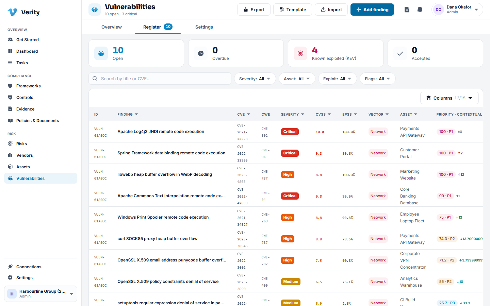
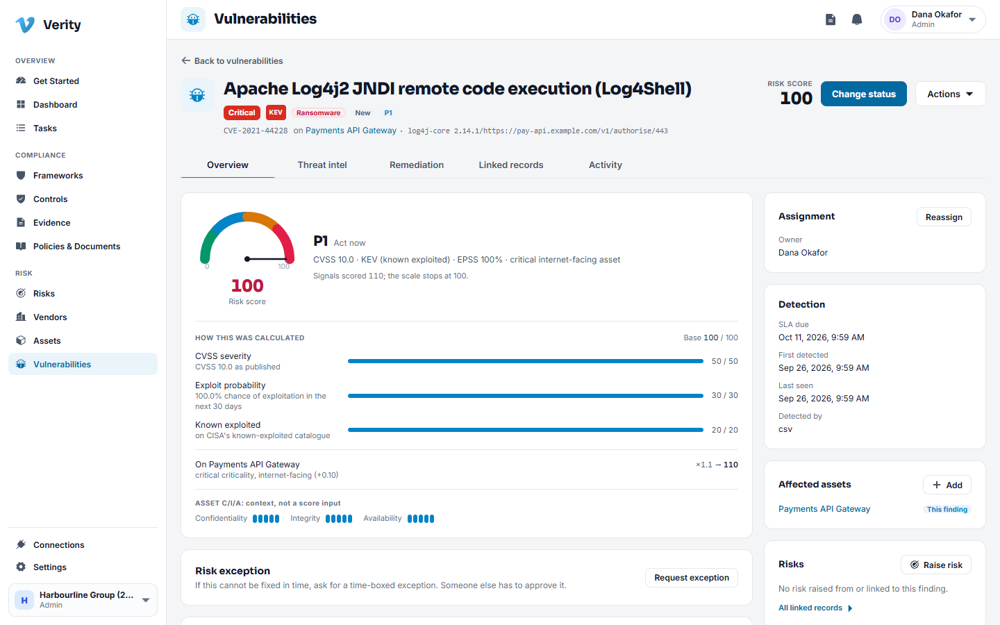
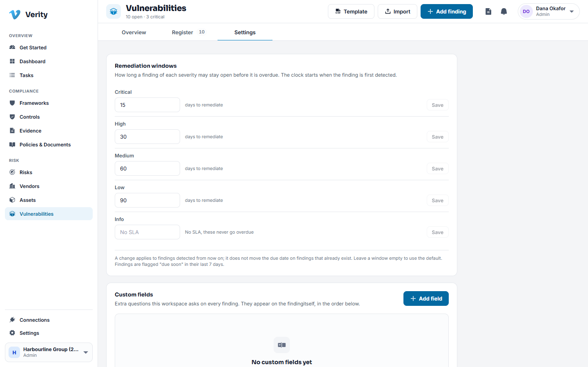
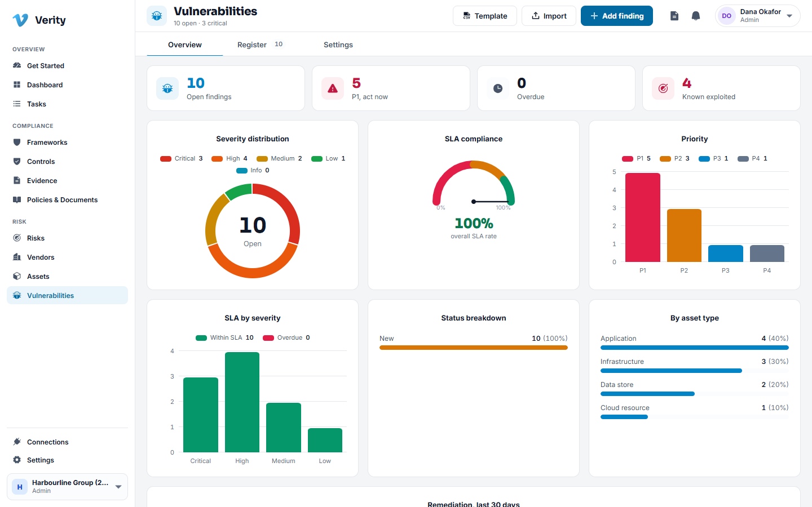

# 10. Vulnerabilities

## What this module does

Scanners produce thousands of findings. This module turns that pile into a list
somebody can work, in the order that actually reduces your risk, with a clock on
each one.

## Definitions and findings

Two things share the module.

- A **definition** is the weakness itself, for example CVE-2021-44228 (Log4Shell).
  It is the same weakness wherever it appears.
- A **finding** is that weakness _on one of your assets_, at one location. Two
  servers with Log4Shell are two findings of one definition.

That split is why you can fix a finding on one host without the register pretending
the whole CVE has gone away.

## Priority: why the order is not just CVSS

A CVSS score describes the weakness in the abstract. Verity prioritises what it
means _to you_, combining:

- the weakness: CVSS, whether an exploit exists, the EPSS probability that it will
  be exploited, and whether it is on the Known Exploited Vulnerabilities catalogue,
- the asset: its criticality, whether it is internet facing, whether it carries
  regulated data.

A medium CVSS on your payment gateway can outrank a high on a test box, which is the
right answer. A finding on the KEV catalogue is floored at a high priority no matter
what else is true, because something is being exploited right now.

## Getting findings in

### Walkthrough: import a scanner export

1. Go to **Vulnerabilities** and choose **Import**.
2. Give the report a name, for example "Quarterly external scan", pick the report
   type and name the tool.
3. Upload the CSV. The file can be up to 10 MB.
4. Verity matches each row to an asset in your inventory, deduplicates against what
   is already open, and tells you what it created, what it updated, what resurfaced
   and what it could not match.

Findings that resurface after being fixed are marked as such and carry a count, so a
recurring failure is visible instead of looking like a new problem each time.

### Walkthrough: add a finding by hand

1. Click **Add finding**, or open an asset and add it from the
   **Vulnerabilities** tab, which fills the asset in for you.
2. Enter the title, severity and affected asset.
3. If you have a CVE identifier, enter it: Verity looks it up and fills in the
   description, score, vector and threat intelligence.

## Working a finding

| State          | Meaning                                              |
| -------------- | ---------------------------------------------------- |
| New            | Just arrived, not triaged                            |
| Active         | Triaged and confirmed                                |
| In progress    | Being fixed                                          |
| Pending retest | Fixed in the team's view, waiting on proof           |
| Fixed          | Verified as fixed                                    |
| Resurfaced     | Was fixed, has come back                             |
| Accepted       | Tolerated on purpose, with an approval and an expiry |
| False positive | Not real, with a reason recorded                     |

A finding is never closed on assertion alone. **Fixed** means a scanner confirmed it
or an approval was recorded.

## Remediation windows

Every finding gets a due date from its severity. The shipped defaults are 15 days
for critical, 30 for high, 60 for medium and 90 for low, with no clock on
informational.

Change them in **Vulnerabilities > Settings**. A change applies to findings detected
from then on, and does not silently move the due date on findings that already
exist.

Findings are flagged "due soon" in their last seven days, and breached findings
escalate to the owner.

## Remediation plans

For work that is more than a patch, a finding carries a plan that moves through
preview, approval, apply and verify. Each step is recorded, so the trail shows what
was proposed, who approved it, when it was applied and how it was verified.

## Exceptions and acceptance

Sometimes the fix is worse than the finding, or it cannot be done yet.

1. Open the finding and request an exception.
2. State the justification, the compensating controls and an expiry date.
3. An approver decides.
4. On expiry the acceptance lapses and the finding returns to the open register.

## Custom fields

Scanners fill most of a finding. What they cannot know is your change ticket
number, the business sign off, the maintenance window. Add those as custom fields.

1. Go to **Vulnerabilities > Settings > Custom fields** and add a field.
2. It appears on every finding under "Also recorded", where anybody with manage
   rights can fill it in.

## Overview

Open findings by severity, what is overdue, throughput over time, and where the
concentration sits.

---

Next: [Connections](11-connections.md)
