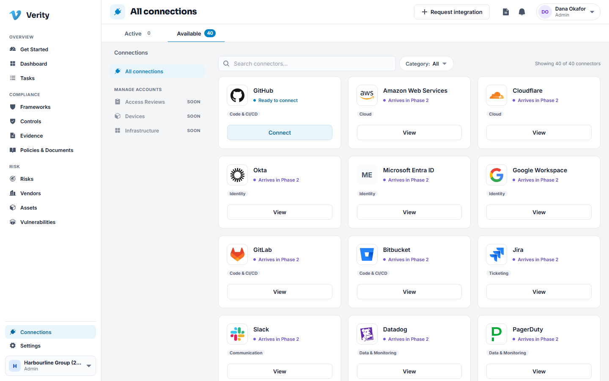
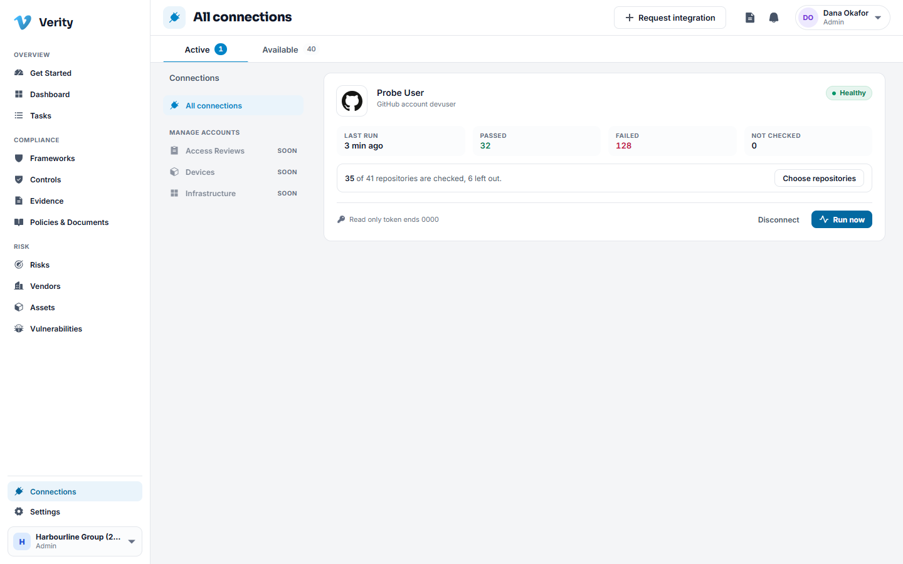
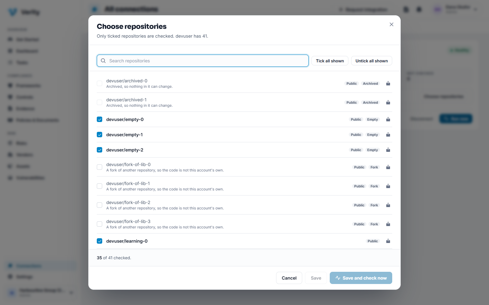
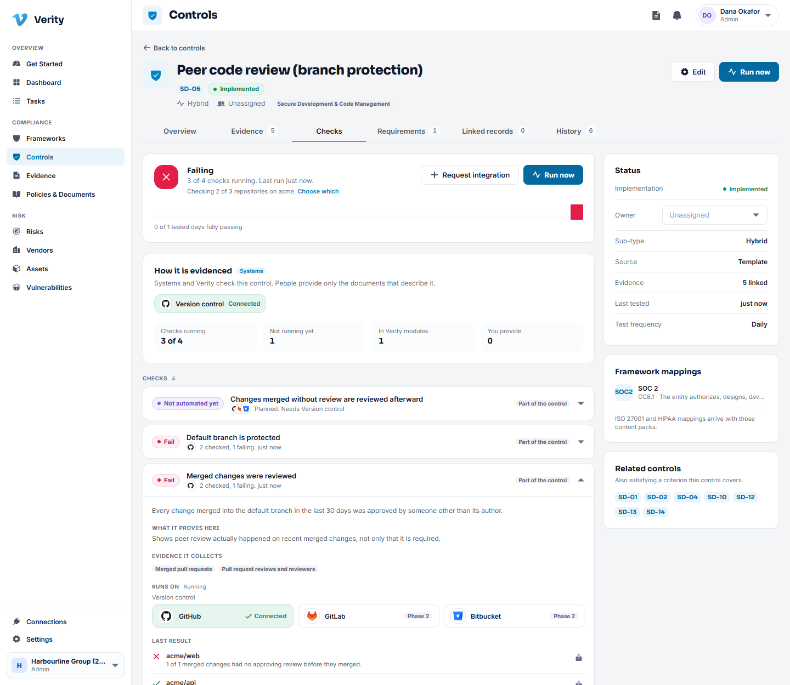
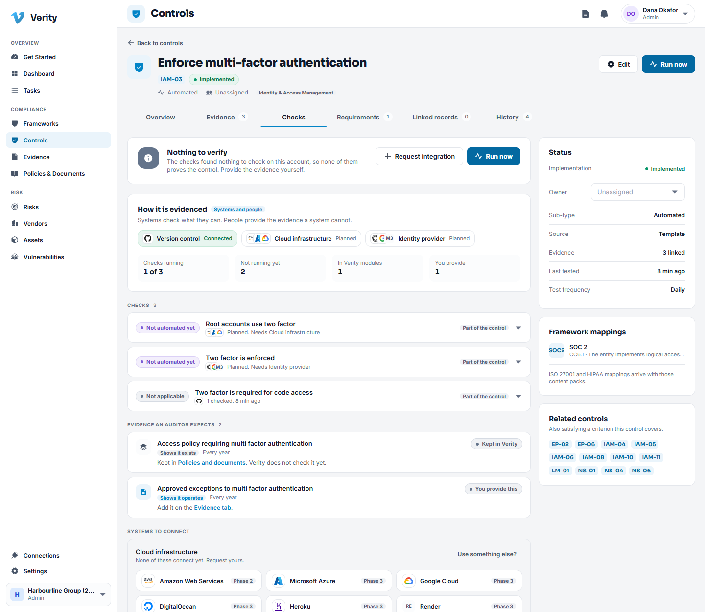

# 11. Connections

## What a connection does

A connection lets Verity check a system for you, on a schedule, and attach what it
finds to the controls those checks answer. Instead of somebody screenshotting a
setting every quarter, the setting is read every day and the evidence appears on its
own.

## What is available today

**GitHub** is the first live connector. Later phases add identity providers, cloud
accounts, device management and ticketing. Anything marked **Soon** on this page is
not connected to real data yet.

You can register interest in a system that is not there yet using the request
option. It records what you need so it can be prioritised.

## Walkthrough: connect GitHub

1. Go to **Connections** and choose **Connect** on GitHub.
2. Give the connection a name, for example "GitHub, engineering org".
3. Paste a personal access token with read access to the organisation you want
   checked. Read only is enough, and read only is what you should use.
4. Save. Verity encrypts the credential before it is stored, and it never appears in
   a log or on a screen again.
5. The first run starts right away. After that it runs on a schedule.
6. **Choose which repositories count.** Read the next section before you rely on the
   result: by default Verity checks everything the token can see.

> **Use a token that can only read.** Nothing in Verity needs to write to your
> source control, and a read only token limits what a mistake can cost.

## Choosing which repositories are checked

A token reaches every repository its owner can read. For an organisation that is mostly
the product. For a personal account it is also every fork and every piece of coursework,
and judging all of those fills the control page with failures nobody can act on and no
auditor will ask about. A SOC 2 audit covers named systems, so you say which.

The card tells you what is being judged: "35 of 41 repositories are checked, 6 left out".
Without doing anything, archived repositories and forks are left out and say why.

### Walkthrough: choose the repositories

1. Open **Connections**, go to the **Active** tab, and click **Choose repositories** on
   the connection.
2. Tick the repositories that are part of the system under audit. Untick the rest. Use the
   search box and **Tick all shown** or **Untick all shown** to work in bulk.
3. If you left any out, give one reason. It applies to every repository you untick in this
   save, so forty sandbox repositories need one sentence, not forty.
4. Click **Save and check now**, or **Save** to wait for the next scheduled run.

> **A reason is required, and it is printed on the evidence.** Each repository you leave out
> keeps its reason and who decided it, the decision is written to the audit log, and every
> evidence file lists what was not checked. An auditor reading a clean result can then see the
> population it was clean over. Your decision stays until you change it: a run never
> overwrites it. Archived repositories are always left out, because nothing in them can
> change.

Repositories with no commits yet show an **Empty** badge. They stay in scope but have nothing
to check, so their results read **Not applicable** rather than failing.

## What the checks look at

The GitHub connector answers questions a SOC 2 auditor asks about how software gets
built and released, for example:

- is two factor authentication required for the organisation,
- are branch protection rules in place on the default branch,
- are pull requests reviewed before merge, by someone other than the author, and before
  the merge happened,
- who has administrative access,
- are secret scanning and dependency alerts switched on.

Each check maps to the controls it can support.

## Reading the results

Open a control and go to its **Checks** tab.

- **Passing** means at least one test ran and found what the control claims, and none failed.
- **Failing** means a test ran on a repository in scope and found something else. The detail
  says which repository and what to change.
- **Could not check** means Verity could not read the setting: the token expired, lacks a
  permission, or GitHub was unreachable. It is never shown as a failure, because it says
  nothing about the control.
- **Out of date** means the last check is more than two days old, for example because a
  token expired or a run did not happen. It replaces Passing and Failing alike, because
  nothing known is current, and it blocks readiness until the checks run again.
- **Nothing to verify** means every test found nothing to check. A personal account cannot
  require two factor for other people, for example, so the two factor control is verified by
  nothing and must be evidenced manually. This is deliberately not shown as "Passing".

A line under the status says how much was checked: "Checking 35 of 41 repositories on
devuser", with a link to change it. It appears on controls that have repository level tests.

The output is attached to the control as evidence, dated, so the control's evidence
list fills without anybody uploading anything. The file lists what was checked and, under
`scope`, each repository that was left out with its reason. Evidence is attached at most once
a day unless the result changes, so a passing check does not bury the record in identical
copies. A failing run is filed too, because it is the dated record of what was observed, but
it never makes a failing control look ready: readiness looks at the tests as well as the
evidence.

### When the plan, not the setting, is the problem

GitHub's free plan does not offer branch protection on private repositories, and some
security features need a paid plan. Verity tells these apart from a missing permission. The
result is a failure, because the control's aim is not being met, and it says what to do:
upgrade the plan, or leave the repository out with a reason. It does not tell you to grant a
permission your token already has.

### What "protected" means

The default branch counts as protected when changes can reach it only through review: a pull
request is required, pushes are restricted to named people or teams, or the branch is locked.
Protection that only stops deletion or force pushes does not count, because anyone with write
access can still push straight to the branch.

## When a connection breaks

A connection whose token has expired or whose permissions were reduced shows as
unhealthy on the Connections page with the reason. The checks stop rather than
quietly report a pass. Reconnect with a fresh token and the schedule resumes.

---

Next: [Settings and administration](12-settings-and-administration.md)
