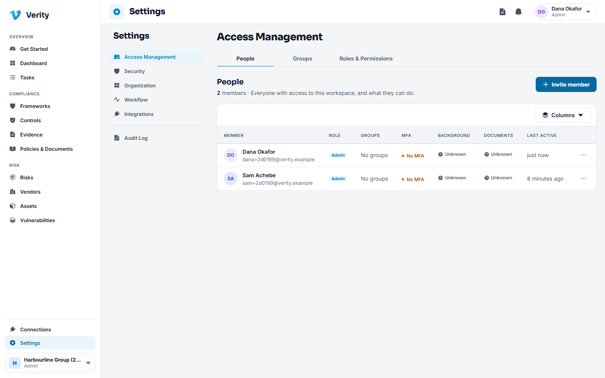
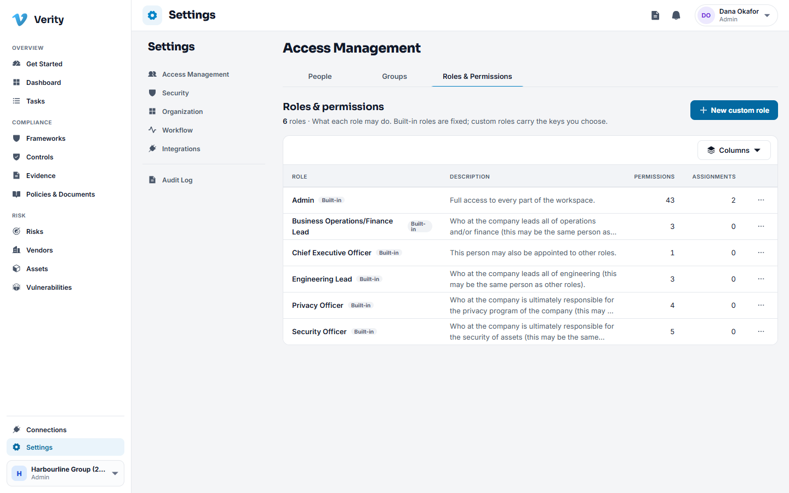
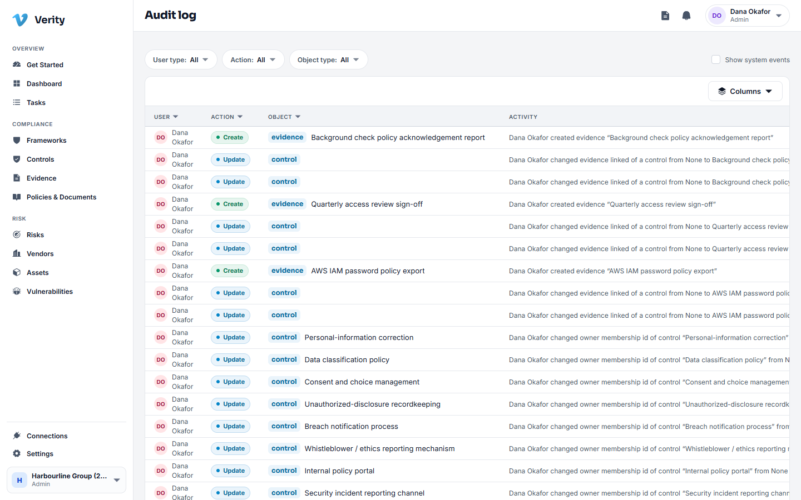

# 12. Settings and administration

This chapter is for whoever administers the workspace. Everything here sits under
**Settings** at the bottom of the navigation.

## People

### Walkthrough: invite someone

1. Go to **Settings > Access > People** and click **Invite**.
2. Enter their work email and choose the roles they should hold.
3. For an external auditor or consultant, set an **access window**: the dates
   between which they can sign in. Outside those dates the account still exists but
   cannot get in.
4. Send. They get an email, set their own password, and enrol in two factor
   authentication if your policy requires it.

### Removing someone

Disable the membership rather than deleting it. Their name stays on the approvals
they gave and the evidence they collected, which is the point: an audit trail with
holes in it is not an audit trail.

## Roles

Verity ships six roles. Five of them are about accountability rather than access:
they name who is answerable for an area, and they start with read access.

| Role | Starts with |
|---|---|
| Admin | Everything |
| Chief Executive Officer | Workspace read |
| Security Officer | Workspace, audit log, frameworks, evidence, vendors |
| Privacy Officer | Workspace, audit log, frameworks, vendors |
| Engineering Lead | Workspace, frameworks, evidence |
| Business Operations/Finance Lead | Workspace, frameworks, vendors |

You can create roles of your own and choose exactly which permissions they carry.
Permissions read as `module:action`, for example `vendors:manage` or
`evidence:review`.

> **Deny by default.** A permission nobody has been granted is denied. If somebody
> cannot see a module, add the permission to a role rather than making them an
> admin.

### Roles and what they allow

Access has two layers.

1. **The permission** decides whether you can reach a screen at all.
2. **Object scope** decides which rows you see once you are there. A control owner
   sees the controls assigned to them; an auditor sees the engagement window they
   were invited for.

## Groups

Groups are teams: Engineering, Finance, the Security Council. They are useful in
three places: assigning a control or task to a team, targeting an acknowledgement
campaign at everyone in a department, and naming a group as an approver where any
one member can decide.

## Security

**Settings > Security** holds:

- **Two factor authentication**: whether it is required, and for which roles.
  Requiring it for admins is the usual minimum.
- **Password policy**: length and complexity. The shipped rule is 12 characters
  with mixed case, a digit and a symbol.

## Organisation profile

Your legal name, trading name, registration number, address and primary contact.
This is what appears on exported reports, so it is worth getting right before your
first audit.

## Custom fields

Two modules let you add fields of your own: [Assets](09-assets.md#custom-fields) and
[Vulnerabilities](10-vulnerabilities.md#custom-fields). Each is configured on that
module's own Settings tab, so the permission that guards the module guards its
fields.

## The audit log

Every state changing action in the workspace writes a row here: who did it, when,
what the record looked like before and what it looked like after.

The log is append only. It cannot be edited or deleted by anyone, including an
administrator, and that is enforced by the database rather than by convention. When
an auditor asks how you know your records have not been quietly rewritten, this is
the answer.

Filter it by user type, action or object type.

### Exporting the audit log

Choose **Export** at the top of the page to download the log as an Excel file or a
CSV file, oldest event first. Give a **From** and a **To** date to cover a period such
as the audit window. Both are optional, both days are included, and they are UTC
days. Tick **Include system activity** to add sign ins and workspace setup, which the
page hides by default.

Each row says who acted, when in UTC, what they did, what it was done to, and the
values before and after as text. The Excel file adds a second sheet that records who
exported, when, the dates chosen and how many rows it holds, so a copy that is passed
around still says where it came from. Excel holds up to 50,000 events. For a longer
period choose a narrower range, or use CSV, which has no limit.

The export is itself written to the audit log, so the log shows who took a copy and
when. A value that starts with an equals sign, a plus, a minus or an at sign is saved as
text with a leading apostrophe, so nothing typed into Verity can run as a formula when
the file is opened. Anyone who can read the audit log can export it.

## Data isolation

Each workspace is sealed. A person who belongs to two organisations sees one at a
time, and there is no screen, filter or export anywhere in the product that can show
data from two workspaces together. This is enforced in the database itself, on every
query, not in the interface.

---

Next: [Glossary](13-glossary.md)
